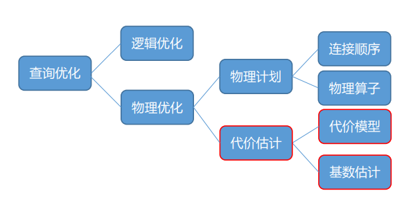

# 2021.01.08 分享纪要

- 分享人: 朱道冰
- 关键词: 查询优化、基数估计
- Keywords: Query Optimization, Cardinality Estimation
- 分享PPT: [2021-01-08-基数估计相关方法介绍](./slides/2021-01-08-Introduction-of-Cardinality-Estimation-Methods.pdf)

介绍了基数估计的概念、难点，介绍了基于统计信息的基数估计方法及基于 Query 结构进行特征编码的机器学习方法。

## 基数估计概念

基数数学意义上是一个集合中不重复的元素个数，在数据库领域主要有两种用法：
- 列的基数：不同值的个数（不可重复），即 #distinct values，低基数，高基数就是这个含义。
- 关系的基数：关系的行数（可重复），即 #tuples。

基数估计对物理执行计划或其子计划（中间结果）基数（行数）的估计。

基数估计是查询优化的重要部分，查询优化分为逻辑优化和物理优化。逻辑优化主要是根据关系代数把语法分析树优化成逻辑查询计划树。
根据连接顺序，物理算子的不同一个逻辑查询计划树可以转换成不同的物理执行计划，物理优化主要是依据代价估计从物理执行计划搜索空间中选出一个尽可能好的物理执行计划用于执行。



代价估计主要由代价模型和基数估计两个点。基数估计是代价模型的输入，代价模型的cost的主要是IO代价+CPU代价+（网络IO代价），如下图所示，其中P是一个计划需要读取的磁盘页面，a_page_cpu_time是一个页面读取的cpu时间，T是访问的元组数（一个页面可以解析成很多元组），W是权重因子（选择率）表示了IO到CPU的相关性。权重因子可以理解成每个元组CPU的开销[1]（3.1.1代价模型）。预计访问的页面数（P）和访问元组数(T)都与物理执行计划或其子计划（中间结果）的基数相关，通过执行去获取中间结果的基数就没有必要选择执行计划了，因为已经执行完了):，所以有了基数估计这个研究问题。


现有cost-based database都有基数估计功能，一般可以通过EXPLAIN语句查看优化器的基数估计和代价估计值，以PostgreSQL为例：


## 基于统计信息的基数估计方法

### 直方图

直方图（Histogram）是统计学中一种对数据分布情况的图形表示。直方图有:

* 等宽直方图：横坐标上不同bucket宽度相等。

  等宽直方图密集和稀疏范围拥有一样多数量的buckets，最坏情况下误差更大。

* 等深直方图：不同bucket的纵向高度一致，bucket宽度不需要相等。

  等深直方图密集的范围拥有更多的buckets（更能体现高频数据的重要性），最坏情况下误差更小，误差被限制在bucket size[5,6]。


直方图使用均匀分布假设（假设一个bucket内部的值均匀分布）简化了计算模型，这会带来计算误差，假设上图[2]是对s表f列的直方图:

```sql
SELECT COUNT(*) FROM s WHERE s.f<=2;
```

执行上面SQL语句时，在均匀分布假设下估算的值为 16 / 7 * 2 = 4.5，实际的值是3（1+2），出现了误差。

真实的商业数据库中直方图是必备的统计信息，下图介绍了PostgreSQL是如何使用直方图进行基数估计的[3]：

PostgreSQL使用的是等深直方图，每个bucket的频率是10%，<1007部分的数据涉及两个bucket,[0,993)的全部,以及[994,1997)的部分，通过均匀分布假设计算出查询范围在总bucket的占比为0.100697,乘以该表的总tuples数量即为估计的基数1007。更具体的介绍可以参考[6]。


直方图主要适用于范围查询，整数等可枚举的类型的点查应该是可以支持的，浮点数这种不可枚举的误差会比较大。

### Sketch

Sketch被广泛应用于大数据领域背景下的基数估计，我了解的有这些方法：cout-min sketch[8]，FM sektch[9] ，LinearCount [10]，
LogLog [11]，HyperLogLog [12]。

以TiDB使用的Count-Min Sketch为例[5]：

* 对每个item，采用d个hash函数映射到d个hash表对应的位置并累加次数。
* 查询某个item出现次数时，返回d个hash表对应位置的频数的最小值。


Sketch主要适用于点查，其思想有点类似于布隆过滤器。

### Most Common values(MCVs)

另一种常用的统计信息是Most Common values，保存10个出现频率最高的值和它的频率，主要适用于点查。值得注意的在使用均匀分布的时候如果在有MCV数据的情况下，最好是要去除MCV数据的占比（28定律）再进行均匀分布，这样有助于提高准确率。下图[3]为例：

当要查询的只在MCV中，可以直接从获取对应的概率分布乘以表大小计算基数；如果值不在MCV中，需要扣除MCV占比在取剩余概率的平均值用作选择率。


### 统计信息生成与更新

统计信息的生成和更新与基数估计准确率息息相关，非常重要，下面是我自己概括的一些分类。

统计信息生成更新时机：

* 手动（VACUUM，ANALYZE）

* 触发(a few DDL cmds:CREATE INDEX) 
* 根据统计信息健康度来触发

统计信息生成更新方式：

* 随机采样生成统计信息（PostgreSQL）
* 全表统计

更多统计信息方法可以参考[13]这篇综述。

## 基数估计的难点与数据集

除了前面提到的直方图使用到的均匀假设，现在商业数据库实现中主要有三个假设用于简化代价估计模型的计算[14]：

* uniformity：均匀分布假设

  > all values, except for the most-frequent ones, are assumed to have the same number of tuples。

* independence：独立分布假设

  > predicates on attributes (in the same table or from joined tables) are independent。

* principle of inclusion：包含假设

  > the domains of the join keys overlap such that the keys from the smaller domain have matches in the larger domain。

然而真实数据集的数据分布往往不符合这三个假设：

* 上面直方图的例子实际数据就违反均匀分布假设了。

* 一个员工表中的年龄和工资两列往往存在相关性，年龄越高的人的工资往往会更高，使用独立分布假设在计算不同选择谓词的组合（and 或 or等）选择率、以及连接谓词选择率时会出现误差。
    ```sql
    SELECT COUNT(*)
    FROM Employee
    WHERE Age < 25 and Salary < 15k
    ```

    如果基于独立性假设（Age < 25的选择率是40%,Salary<15k的选择率是60%）

    Rows = 40% * 60% * Total rows =24% Total rows 

    RowsReal = 30% Total rows

    因为忽视了列与列之间的关联关系，出现了低估（under estimate）。

* 包含假设在主外键连接的时候是满足的（外键约束），如果不存在主外键关系的两个列之间进行连接就会违反包含假设。

## 基于采样的基数估计方法

采样是一种以点带面的方法：

* 一方面采样能够减少各种统计信息生成时的开销，往往与上述统计信息方法结合使用。
* 另一方面，有效的采样能够较好的体现出数据的分布，直接在小范围的采样数据上执行要估计的执行计划树或SQL语句也是一种基数估计的方法，能够有效避免因为上述假设而出现的误差，但一次查询优化需要Explore不同执行计划树，需要调用多次代价估计和基数估计，在采样上进行基数估计的开销可能难以接受。

简单的采样还会出现采样消失问题，如图，前两个表连接之后的中间结果比较小，再和下一个表连接很有可能会出现没有符合连接条件的情况。


这篇[15]论文提出了利用索引进行采样的一种思路，只进行一次采样操作，后续连接使用索引进行，如果中间结果过大，会对中间结果再进行采样从而限制采样估计开销，这篇博客[4]对其进行了讲解。

```txt
1. 在A上sample 100个records
2. 在100个records apply A.id=1得到4个records 
3. 对于4个record，每个利用B.id上的index直接做等值查询（即join）的结果： 
record#1对应了100个B.id
record#2对应了200个B.id
record#3对应了300个B.id
record#4对应了400个B.id 
这样A和B join完得到了1000个record（文中称之为的intermediate result） 
4. 遍历这1000个record，每个利用B.h上的index直接做等值查询：
record#1对应了2个C.id 
record#2对应了1个C.id
record#3对应了0个C.id ... 
这样得到了20个结果 
5. return 20
6. 通过20及采样情况进行基数估计 # 在博客的基础上我加了一句。
```

## 基于机器学习的基数估计方法（基于Query）

机器学习首要要解决的问题就是如何特征编码，在基数估计领域，可以用于编码的对象随着SQL语句的执行生命周期可以有下面几种，越往后面需要编码的特征越多，难度越大，相应地特征也越丰富。

* 面向SQL语句编码
* 面向Abstract Syntax Tree编码
* 面向Logical plan编码
* 面向Physical plan编码

​	...

### 面向SQL查询语句编码

MSCN（MSCN:multi-set convolutional network）[16]是2019年发表在CIDR的一篇基数估计论文，他直接对SQL语句进行编码，用真实SQL语句的基数作为标签，使用多个卷积神经网络对Select的表格，连接谓词，选择谓词进行特征编码与学习，比较巧妙地将采样引入于特征编码中(采样能体现真实分布)，其网络结构如下图所示，对每个部分的特征编码使用一个卷积神经网络进行学习，最后将三个网络的输出平均池化再concat后传入最后一个卷积神经网络中。


* 不同set使用不同网络学习对应特征。
* 不同SQL语句涉及到的表格、连接谓词、选择谓词数量不同，使用平均池化进行归一。
* 将不同网络学习到的特征合并到一起再输出。

#### 编码解析：

该工作有[开源代码](https://github.com/andreaskipf/learnedcardinalities)，下面是基于其开源代码对其编码进行详细解析：

* 对所有参与的表，连接谓词，列，选择谓词中的操作符号进行one hot 编码。

* 对选择谓词中第二操作数数值使用min max归一化。


* 通过从数据中采样出1000条tuple判断是否符合对这个表的选择谓词来生成采样bitmap。


* 有监督标签。

  

以论文图上对应的SQL语句进行编码举例。

  


模型图中的三个输入分别是Table Set, Join Set, Predicate Set：

* Table set: {table1_one_hot|（拼接）table1_bitmaps ， table2_one_hot | table2_bitmaps…}

  一个table: table + sample bitmaps = 1006个float，本例中一共有两个表。

* Join set:{join1_one_hot ， join2_one_hot…} 

  一个join predicate: 6个float，本例中只有一个join谓词。

* Predicate set:{column1_one_hot|operator1_one_hot|vale1_float…}，其中value也是用和label一样的标准化方法

  一个predicate: 9 + 3 + 1 = 13个float，本例中有两个选择谓词。

* Label:

  

MSCN是机器学习与基数估计相结合比较重要的工作，基于作者之前的[14]提出的JOB数据集展示了传统基数估计方法与机器学习方法、真实基数之间存在的巨大沟壑，引出了很多后续工作。

### 面向Physical plan编码

面向SQL语句编码的方法的输入是SQL语句，而在查询优化中是要对SQL语句选择一个较好的物理执行计划，需要对中间结果的执行计划进行基数和代价估计，只知道一个SQL语句的执行结果对查询优化的意义不大，所以有很多工作开始基于物理执行计划树做特征编码。使用强化学习来估计cardinality/cost [17]，Plan-Structured DNN[18]，Neo[19]，Learning-based cost estimator（Tpool）[20]。

下面以Tpool为例进行详细介绍。
####  组件


* Training Data Generator
  * 根据数据集（IMDB，JOB），建立join graph,节点是table,边是两表之间的PK-FK。选几个表通过一定的规律生成连接 predicate以及选择predicate。 
  * 对于每一个query，用真实的optimizer获取其physical plan, real cost,real cardinality。
  * a triple: <a physical plan,the real cost of the plan, the real cardinality of the plan>。
* Feature Extractor：将physical plan编码
  * One-hot encoding :table ,column ,operator ,operation。
  * 连接/选择 predicate: <column, operator, operand>。
* Tree-structured Model：对执行计划树进行编码

  使用树型模型更好地学习和预测cost & cardinality。

#### 特征编码

* Excution Plan：Physical Plan
  
  1-9个（DFS遍历）物理算子节点。
* One-hot Encoding
  * Operator: 选择/连接predicate可能用到的全部操作符
  * Operation：全部物理算子（scan,join）
  * Table Name: 全部表
  * Column: 全部列
  * Dictionary
    * 词向量，再把规则转换成tensor
* Sample Datasets：同MSCN


* predicate 编码

  当有多个选择谓词进行组合时（compound predicate），为了AND OR这些组合操作的特征，不是直接使用MSCN的直接拼接的办法，使用max pool来编码OR，使用min pool来编码AND，形成一个树。

  

### 模型

两层树模型(Two Level Tree Model)，对执行计划树(上层tree)进行编码，每个算子节点使用谓词编码树(底层tree)进行特征编码。

* Embedding Layer

  特征编码处理上述compound predicate特征。

* Representation Layer 

  使用LSTM学习执行计划的特征,底层算子的模型参数会传递给下一层算子节点，以期望学到不同层级算子直接的关系。

* Estimation Layer 

  使用multi learning同时估计cost和cardinality。


Tpool这篇在MSCN的基础上做了大量的改进，如使用Tree编码对组合谓词进行编码，使用树型LSTM直接对执行计划树编码，除此之外还提出了一种基于Rule Generation的string谓词编码。


时间有点久远了，如有纰漏，或者忘记引用，感谢大家指出，后续组会分享中也分享过基于数据分布的学习方法，以及基于机器学习的基数估计方法的落地可行性相关论文。

## 参考文献

[1]李海翔. (2014). 数据库查询优化器的艺术 : 原理解析与SQL性能优化 : The art of database query optimizer principle and SQL performance optimization. 机械工业出版社.

[2] https://db.inf.uni-tuebingen.de/staticfiles/teaching/ws1011/db2/db2-selectivity.pdf

[3] [PostGreSQL: Row Estimation Examples](https://www.postgresql.org/docs/13/row-estimation-examples.html)

[4] [知乎：Cardinality using sampling (index sampling)](https://zhuanlan.zhihu.com/p/149904515 )

[5] [TiDB 源码阅读系列文章（十二）统计信息（上）](https://zhuanlan.zhihu.com/p/39139693)

[6] [Histograms in MariaDB, MySQL and PostgreSQL](https://www.slideshare.net/SergeyPetrunya/histograms-in-mariadb-mysql-and-postgresql)

[7] Piatetsky-Shapiro, G., & Connell, C. (1984). Accurate estimation of the number of tuples satisfying a condition. *ACM Sigmod Record*, *14*(2), 256-276.

[8] Cormode, G., & Muthukrishnan, S. (2005). An improved data stream summary: the count-min sketch and its applications. *Journal of Algorithms*, *55*(1), 58-75.

[9] Flajolet, P., & Martin, G. N. (1985). Probabilistic counting algorithms for data base applications. *Journal of computer and system sciences*, *31*(2), 182-209.

[10] Whang, K. Y., Vander-Zanden, B. T., & Taylor, H. M. (1990). A linear-time probabilistic counting algorithm for database applications. ACM Transactions on Database Systems (TODS), 15(2), 208-229.

[11] Durand, M., & Flajolet, P. (2003, September). Loglog counting of large cardinalities. In European Symposium on Algorithms (pp. 605-617). Springer, Berlin, Heidelberg.

[12] Flajolet, P., Fusy, É., Gandouet, O., & Meunier, F. (2007, June). Hyperloglog: the analysis of a near-optimal cardinality estimation algorithm. In Discrete Mathematics and Theoretical Computer Science (pp. 137-156). Discrete Mathematics and Theoretical Computer Science.

[13] Cormode, G., Garofalakis, M., Haas, P. J., & Jermaine, C. (2011). Synopses for massive data: Samples, histograms, wavelets, sketches. Foundations and Trends® in Databases, 4(1–3), 1-294.

[14] Leis, V., Gubichev, A., Mirchev, A., Boncz, P., Kemper, A., & Neumann, T. (2015). How good are query optimizers, really?. Proceedings of the VLDB Endowment, 9(3), 204-215.

[15] Leis, V., Radke, B., Gubichev, A., Kemper, A., & Neumann, T. (2017, January). Cardinality Estimation Done Right: Index-Based Join Sampling. In Cidr.

[16] Kipf, A., Kipf, T., Radke, B., Leis, V., Boncz, P., & Kemper, A. Learned Cardinalities: Estimating Correlated Joins with Deep Learning.

[17] Jonschkowski, R., & Brock, O. (2015). Learning state representations with robotic priors. Autonomous Robots, 39(3), 407-428.

[18] Marcus, R., & Papaemmanouil, O. (2019). Plan-structured deep neural network models for query performance prediction. arXiv preprint arXiv:1902.00132.

[19] Marcus, R., Negi, P., Mao, H., Zhang, C., Alizadeh, M., Kraska, T., ... & Tatbul, N. (2019). Neo: A learned query optimizer. arXiv preprint arXiv:1904.03711.

[20] Sun, J., & Li, G. (2019). An end-to-end learning-based cost estimator. arXiv preprint arXiv:1906.02560.
