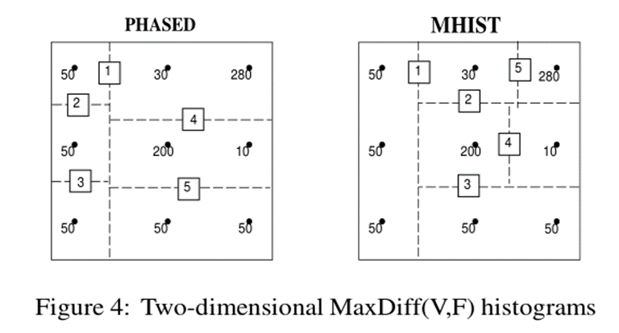
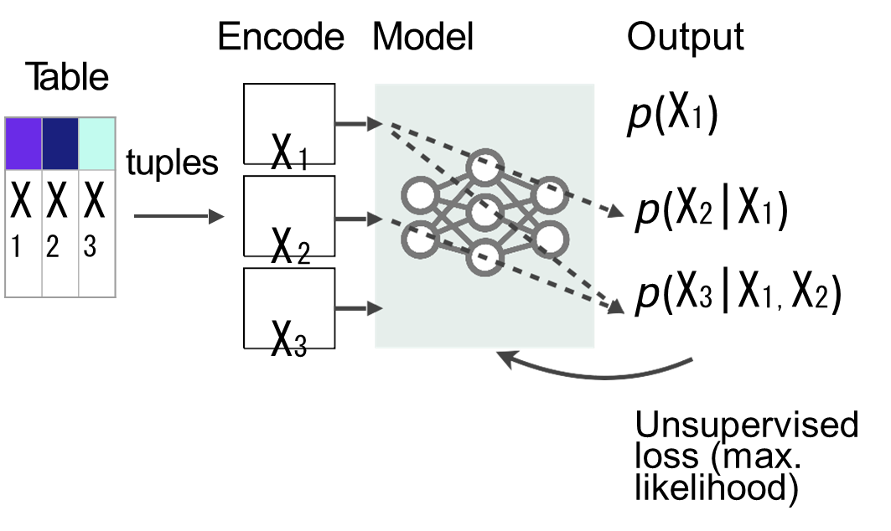
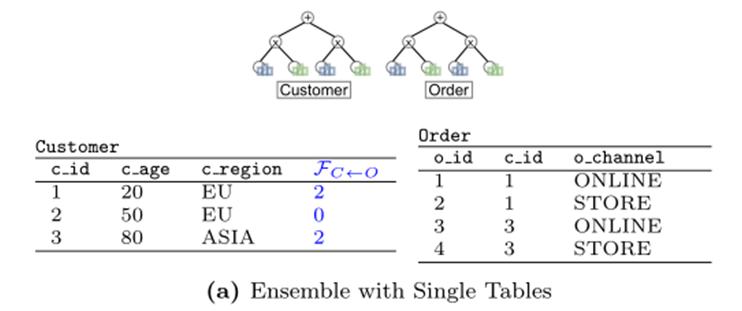

# 2021.05.14 分享纪要

- 分享人: 朱道冰
- 关键词: 查询优化、基数估计
- Keywords: Query Optimization, Cardinality Estimation
- 分享PPT: [2021-05-14-基于数据概率分布的基数估计方法](./slides/2021-05-14-Data-Driven-Cardinality-Estimation-Methods.pdf)

[基数估计相关方法](https://github.com/CDDSCLab/Weekly-Group-Meeting-Paper-List/blob/main/meeting-summary/2021-01-08-%E5%9F%BA%E6%95%B0%E4%BC%B0%E8%AE%A1%E7%9A%84%E7%9B%B8%E5%85%B3%E6%96%B9%E6%B3%95%E4%BB%8B%E7%BB%8D.md)介绍了基数估计的概念、难点，介绍了基于统计信息的基数估计方法及基于 Query 结构进行特征编码的机器学习方法。

本次分享在这个基础上进一步介绍基于概率分布的基数估计方法。

## 基数估计与概率分布的概念

### 基数估计与概率分布转换

**基数估计->选择率估计->数据概率分布**

基数可以通过**整体表数据量**乘以**谓词的选择率**来计算，**整体表的数据量**一般是可知的（叶子节点也就是不同表的统计信息，中间节点是孩子节点的基数估计），所以可以把问题转换为对**选择率的估计**，选择率问题又可以转换为**数据的概率分布**，以[基数估计相关方法](https://github.com/CDDSCLab/Weekly-Group-Meeting-Paper-List/blob/main/meeting-summary/2021-01-08-%E5%9F%BA%E6%95%B0%E4%BC%B0%E8%AE%A1%E7%9A%84%E7%9B%B8%E5%85%B3%E6%96%B9%E6%B3%95%E4%BB%8B%E7%BB%8D.md#%E5%9F%BA%E6%95%B0%E4%BC%B0%E8%AE%A1%E7%9A%84%E9%9A%BE%E7%82%B9%E4%B8%8E%E6%95%B0%E6%8D%AE%E9%9B%86)中介绍的员工表Age和Salary两列为例：

> 如果基于独立性假设（Age < 25的选择率是40%,Salary<15k的选择率是60%）
>
> Rows = 40% * 60% * Total rows =24% Total rows
>
> RowsReal = 30% Total rows

估计的基数通过独立性假设计算的值为24%N，如果知道Age列和Salary列的准确的**联合概率分布**，就能更准确的进行基数估计。

$真实基数=N * p(Salary<15k, Age<25)=0.3N$

联合概率指的是包含多个条件且**所有条件同时成立**的概率，记作P(X=a,Y=b)或P(a,b)。

$P(x_{1},x_{2},...,x_{n})$

通过链式法则，我们可以把 n 维的联合概率分布分解成:

$P(x_{1},x_{2},...,x_{n}) = P(x_{1})P(x_{2}|x_{1})...P(x_{n}|x_{1},...,x_{n-1})$

通过链式法则可以进一步把联合概率分布问题转换为各种条件概率的求解。

### 基于Query和基于数据的对比

基数估计方法介绍的Workload-Driven的学习方法与本次介绍的Data-Driven的学习方法的对比。

## 单属性概率分布估计

对于一个属性（列）概率分布的相关方法。主要有一维直方图和核密度估计。

### 一维直方图

参考[基数估计相关方法介绍#直方图](https://github.com/CDDSCLab/Weekly-Group-Meeting-Paper-List/blob/main/meeting-summary/2021-01-08-%E5%9F%BA%E6%95%B0%E4%BC%B0%E8%AE%A1%E7%9A%84%E7%9B%B8%E5%85%B3%E6%96%B9%E6%B3%95%E4%BB%8B%E7%BB%8D.md#%E7%9B%B4%E6%96%B9%E5%9B%BE)，基于均匀分布假设进行数据分布估计，被广泛应用于商业DBMSs。

### 核密度估计[1]

类似于直方图，使用Kernal(如正太分布)来代替均匀假设。

## 单表多属性概率分布估计

查询谓词中往往会涉及到多个属性，上述方法要怎么拓展到单个表多个属性？

### 多维核密度估计

相比于一维核密度估计方法，多维核密度估计方法使用多维度的核，如多变量正太分布。

### 多维直方图

同理，一维直方图也需要升维度，其难点在于如何划分空间：

* 因为直方图是基于均匀假设。

* 每个bucket的值组合最好频率相似，这样才能符合均匀假设，减小误差。

下面介绍两篇论文的实现。

#### 多维直方图-一种simple的划分方法(PHASED)[2]

以三维（三个属性的情况为例），属性A [1,100]（值范围）、属性B [101,500]、属性C [1001,4000]。

##### 划分步骤

如图所示，图上红字为查询步骤小节使用。

* 表格按第一个属性排序，划分成5个bucket --（1）
* 对（1）中的5个bucket分别按第二个属性排序，每个划分成4个bucket，此时一共有5*4=20个bucket --（2）
* 对（2）中的20个bucket分别按第三个属性排序，每个划分成3个bucket，此时一共有20*3=60个bucket --（3）

##### 查询步骤

查询范围((31, 325, 1250), (50, 375, 2500))举例，图上红字为步骤号。

* 步骤1：属性A（31，50）与 Level1的 2，3Block匹配,先处理Block2跟随指针来到Level2。
* 步骤2：属性B(325,375)只与Block3匹配，跟随指针来到Level3。
* 步骤3：属性C(1250,2500)与Bucket1，2匹配，根据占比估算其概率分布。
* 步骤4：以此类推处理Level1的Block3（空间上可以想象成一个三维长方体）。

均匀分布假设体现在每个block的计算上，会根据占比来估计范围的概率分布。

#### MHIST[3]

* PHASED
  * 生成方法简单粗暴（分裂顺序固定，比如可以先按B属性分）。
  * 生成的bukcet质量比较差，分布不均匀。

* MHIST(multi-dimensional histogram）
  在每一步中选择和划分最“关键”的属性。

多维直方图问题，避免独立性假设的统计和空间开销太大，只能针对极小的数据集。

### 概率图模型-Sum-Product Networks（DeepDB单表[4]）

概率图模型是在图的基础上表示概率分布的模型。

DeepDB使用的Sum-Product Network的思想是通过kmens聚类方法以及RDC(Randomized Dependency Coefficients)判断不同属性之间是的关联性将一个表进行:

* 横向按行的拆分（图(b)蓝色线条，图(c)中**+号**节点），
* 以及纵向切分（图(b)中绿色线条，图(c)中**X号**节点。

整体目标是让每两个**X号**节点的两个孩子节点的属性之间的关联度最低，符合独立性假设，最底层孩子节点直接使用直方图进行单表单属性概率分布估计，往上进行计算时通过独立性假设（**X号**节点）及概率加法原则（**+号**节点）进行计算。

#### 生成步骤

* 步骤1：利用Kmeans等方法将元组分类切分成不同的sum节点。
* 步骤2：利用RDC(Randomized Dependency Coefficients)判断不同属性之间是的关联性，如果存在相关性则回到步骤1继续切分sum节点，当row cluster的行数小于阈值n时则认为两个列之间没有关联性。

#### 查询举例

如图(d)所示，有多少客户时来自Europe并且小于30岁？

$12\% * 0.3 + 2\% * 0.7 = 5\%$

### Naru[5]

Sum-Product Networks底层用上了直方图的方法，Naru则使用的自回归模型（Made）方法，也是一种无监督学习。

#### Workflow

* 指定一个表用于构建Naru estimator。
* 将这个表的所有tuples按batch传入自回归模型。
* 以极大似然估计原则进行一次参数更新。

其思想是将表格所有的tuples按batch传入自回归模型，通过极大似然估计的原则学习出现有数据的概率分布，该方法通过Made模型中的Mask层方式学习到链式法则转换后的**条件概率**，后续估计时直接对条件概率进行乘法即可得到联合概率分布。

#### Made

* 在自编码器的基础上利用MLP作为Mask层
* 在计算P(x1)的时候屏mask掉x2,x3
* 在计算P(x2|x1)的时候mask掉x3...

#### 等值查询

等值查询时，每个属性的值已经被指定

$P(x_{1}=x1,...,x_{n}=xn)$

根据链式法则：

$\hat{P}(X_{1}=x_{1})*\hat{P}(X_{2}=x_{2}|X_{1}=x_{1})*...*\hat{P}(X_{n}=x_{n}|X_{1}=x_{1},...,x_{n-1}=x_{n-1})$

Naru模型能够估计出上式中每个因子的值，最终的联合概率分布就是这些因子的乘积。

#### 范围查询

模型只能估计出等值情况，如何处理范围查询?

##### 小范围

枚举所有可能

##### 大范围

枚举开销会比较大，采用采样的方法。提出了一种progressive smapling方法：

* 传统uniform sampling方法

  一个具有N个具有相关性的表T，每个属性的值都不是均匀分布的，99%的频率属于1%的取值。使用范围谓词选择每个域的前50%的查询。如果使用传统的采样方法，容易出现采样消失的问题。

  > It is easy to see that uniformly sampling from the query region will take in expectation 1/(0.01/0.5)n = 1/0.02n samples to hit the high-mass region we are integrating over.

$  \frac{1}{(\frac{0.01}{0.5})^{n}}  $

* progressive smapling方法

  使用Naru模型估计的条件概率有针对的对高频率数据进行抽样，高频也就是下图下半部分的s1,s2就是高频。

## 多表概率分布估计

查询中的Join连接会涉及到多表数据的联合概率分布，如何把这些上面讲的基于单表的概率分布估计方法扩展到多表方法上？

现有实现（DeepDB、NeuroCard）中是将多个表先连接起来（全外连接full out join, 保留不匹配的值）使用单表的方法学习联合概率分布。

* DeepDB 检查不同表中的每一对属性是否可以认为是独立的，对存在关系的属性学习其RSPN（Relational Sum-Product Networks）。
* NeuroCard是Naru的多表版本，借鉴了DeepDB的思路，对所有表进行全外连接形成一个表，再使用自回归模型对其学习。

### DeepDB

单表扩展到多表，对每一对主外键的全外连接学习其RSPN，使用采样的方法检查不同表中的每一对属性之间是否存在关联性，如果存在则学习其其RSPN（也就是Sum-product network基础上增加了用于拓展和将为的指标）。

#### case1 有完全能匹配的RSPN

* Q1:  E(1c)=P(c)，就是符合c的概率, 有完全符合的RSPN时，可以直接通过RSPN图(a)左表获取对应的概率。

* Q2: 使用图(b)对应的联合概率。

#### case2

有更大表的RSPN，而这个RSPN是通过join生成的，所以原来单表的数据原来的一行可能会因为在另一个表有多行匹配会变得更多，所以需要记录F'c<-o来代表连接匹配的数量，计算的时候好扣除，下例中，以第一行Eu为例，1/5 还要除以2，也就是式中的 1/2*5。

#### case3

从两个单表构建多表的时候要考虑放大，放大系数也是Fc<-o。

### Nerucard（AutoRegressive Models）[6]

Nerucard在Naru的基础上借鉴了DeepDB思想：

* 对所有表全外连接形成的单表使用自回归模型学习其概率分布。
* 全外连接数据量太大，该方法的难点在于**如何公平抽样模拟**。
* 在完全连接J(一个多重集)中的每一个元组必须以1/|J|的概率等概率采样。

#### 采样方法

* 步骤1：自下而上的对可用于连接的属性的每一个值，计算他们的Join counts，即在其他属性中有多少行能和它进行Join。
* 步骤2：samper逐表对连接键进行采样，出现概率与连接计数成正比。
* 步骤3：按选取出的连接键来查询基表以获取非连接键的值。

基于上面这个大宽表进行单表多属性自回归模型的训练和学习。

上图的FB.x就是连接系数，FC.y也是连接系数，用于回退到单表情况，1A,1B,1C是用来快速判断某一行是否可用的，有0的就不能算作这行在可以使用。如上面的Q1，Q2，因为都有1行是因为full out join而出现的，所以要把这行剔除考虑。

时间有点久远了，如有纰漏，或者忘记引用，感谢大家指出。

## 参考文献

[1] https://en.wikipedia.org/wiki/Kernel_density_estimation.

[2] M. Muralikrishna and D. J. Dewitt. Equi-depth histograms for estimating selectivity factors for multi-dimensional queries. Proc. of ACM SIGMOD Conf, pages 28–36, 1988.

[3] Poosala, V., & Ioannidis, Y. E. (1997, August). Selectivity estimation without the attribute value independence assumption. In *VLDB* (Vol. 97, pp. 486-495).

[4] Hilprecht, B., Schmidt, A., Kulessa, M., Molina, A., Kersting, K., & Binnig, C. (2019). Deepdb: Learn from data, not from queries!. *arXiv preprint arXiv:1909.00607*.

[5] Yang, Z., Liang, E., Kamsetty, A., Wu, C., Duan, Y., Chen, X., ... & Stoica, I. (2019). Deep unsupervised cardinality estimation. *arXiv preprint arXiv:1905.04278*.

[6] Yang, Z., Kamsetty, A., Luan, S., Liang, E., Duan, Y., Chen, X., & Stoica, I. (2020). NeuroCard: one cardinality estimator for all tables. *arXiv preprint arXiv:2006.08109*.
