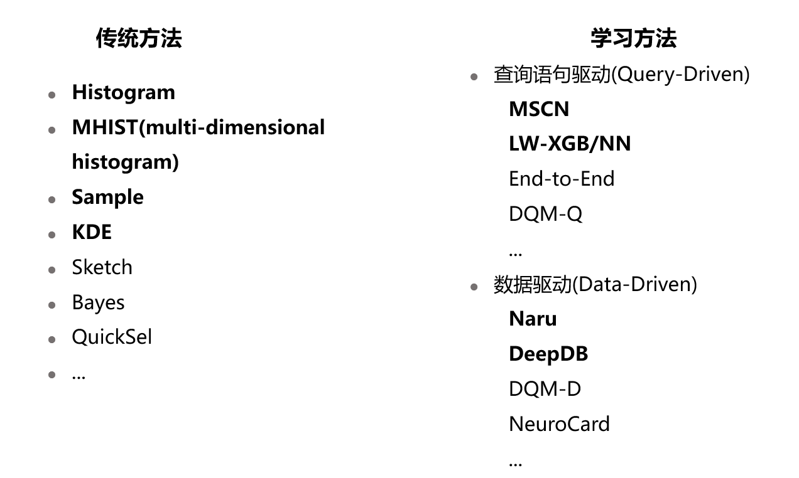
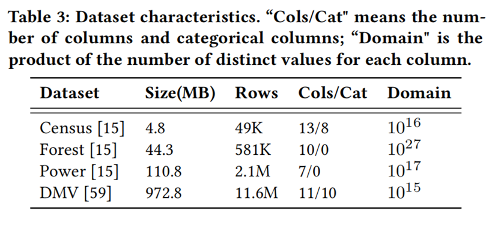
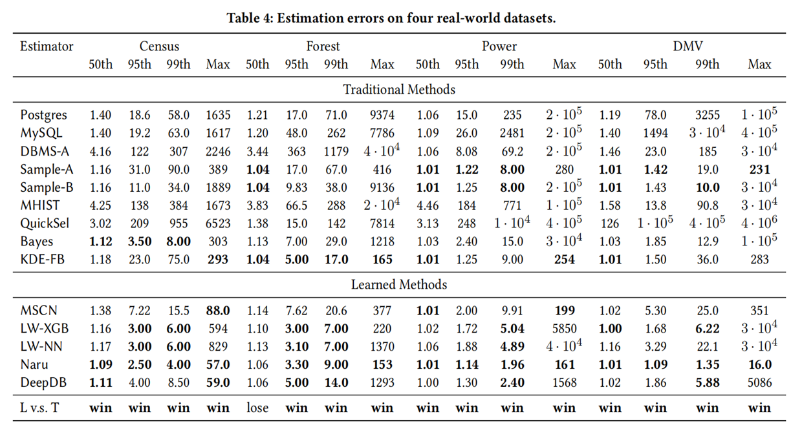
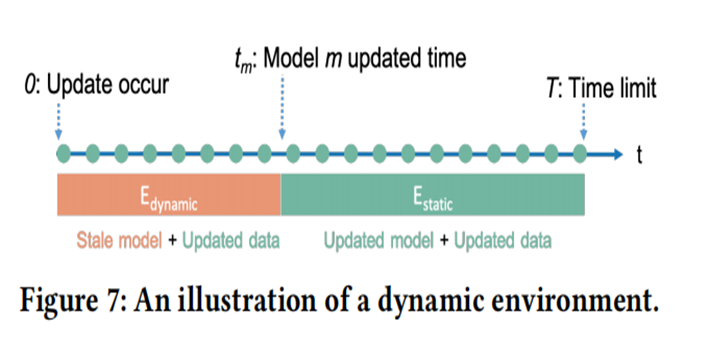
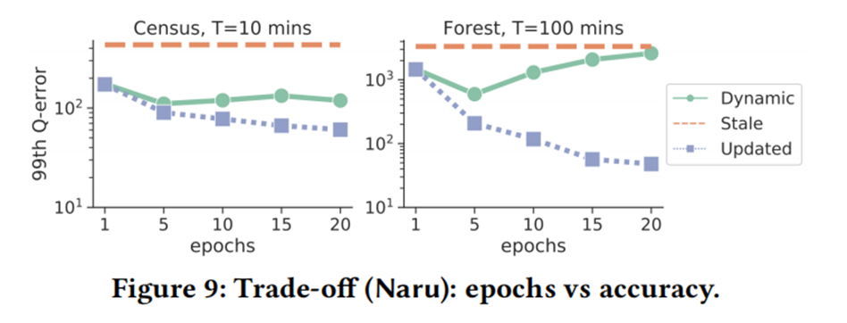

# 2021.10.08 分享纪要

- 分享人: 朱道冰
- 关键词: 查询优化、基数估计
- Keywords: Query Optimization, Cardinality Estimation
- 分享PPT: [基于学习的基数估计方法的可用性分析](./slides/2021-10-08-feasibility-of-learning-based-cardinality-estimation-methods.pdf)

[基数估计相关方法介绍](https://github.com/CDDSCLab/Weekly-Group-Meeting-Paper-List/blob/main/meeting-summary/2021-01-08-%E5%9F%BA%E6%95%B0%E4%BC%B0%E8%AE%A1%E7%9A%84%E7%9B%B8%E5%85%B3%E6%96%B9%E6%B3%95%E4%BB%8B%E7%BB%8D.md)介绍了基数估计的概念、难点，介绍了基于统计信息的基数估计方法及基于 Query 结构进行特征编码的机器学习方法。

[基于概率分布的基数估计方法](https://github.com/CDDSCLab/Weekly-Group-Meeting-Paper-List/blob/main/meeting-summary/2021-05-14-%E5%9F%BA%E4%BA%8E%E6%95%B0%E6%8D%AE%E6%A6%82%E7%8E%87%E5%88%86%E5%B8%83%E7%9A%84%E5%9F%BA%E6%95%B0%E4%BC%B0%E8%AE%A1%E6%96%B9%E6%B3%95.md)进一步介绍基于概率分布的基数估计方法。

本次分享的论文[1]对基于机器学习的基数估计方法的可行性分析。该文章使用统一的数据集和工作负载对近几年并行出现的学习方法进行横向对比实验及分析。主要关注的点有：

* 现有的工作大多集中在静态的环境，没有数据更新。
* 现有的工作缺少对模型个阶段时间开销的研究：
  * 训练时间(training time)
  * 预测时间(inference time)
  * 更新时间(update time)
* 现有的工作缺少对影响模型准确率因素的研究。

## 静态环境中学习方法的可用性分析

### 实验设置

#### 数据集

* 真实世界数据集。
* 大小不同，列与数据分布不同。
* 每个数据集被用于评价至少一个学习方法。

#### 负载

* 同一个实验中使用相同的工作负载。
* 支持1 ~ |列数量| 的谓词数量。
* 同时支持等值和范围谓词。
* OOD -> 不同列之间的谓词生成支持独立性。

### 学习方法的准确率提升

准确率 $q_{error}$ 定义，越接近于1越好。

$$q_{error}=\max({\frac{\hat{C}}{C},\frac{C}{\hat{C}}})$$

图片注解：传统方法，加粗表示能达到的最低值。学习方法，加粗表示比传统方法更高的准确率。

**Learning v.s. Traditional 观察：**

* 学习方法的准确率都优于传统方法。
* 学习方法输的场景下表现也与传统方法较为接近。
* 与真实数据库系统相比，提升巨大。

### 训练时间

训练时间定义：

* 学习方法，训练模型的时间。

* 数据库系统，运行统计信息收集命令的时间。

| **方法**           | **数据集**         | **预测时间量级** |
| ------------------ | ------------------ | ---------------- |
| 数据库系统（采样） | 无关               | 10s内            |
| LW-XGB             | 小数据集  (Census) | 10s内            |
| LW-NN(GPU)         | 无关               | 30minute         |
| MSCN(GPU,CPU)      | 无关               | 100minute        |
| DeepDB             | 小数据集(Census)   | 10minute         |
| DeepDB             | 大数据集(DMV)      | 20minute         |
| Naru(GPU)          | 小数据集(Census)   | 1minute          |
| Naru(GPU)          | 大数据集(DMV)      | 4hour            |

**Learning v.s. Traditional 观察：**

* 数据库系统因为通过采样的方式收集统计信息，能在几秒内完成训练。
* 学习方法中最快的是使用gradient boosted tree的LW-XGB。
* 使用了神经网络的模型(MSCN，LW-NN)训练时间与数据集大小无关，与训练数据量有关，30-100minute
  其中MSCN因为使用了if-else语句导致GPU和CPU耗时差不多。
* Data-Driven的DeepDB和Naru训练时间与数据集大小有关，小数据集上几分钟，大数据集上甚至需要几个小时。
* DeepDB因为使用的是SPN网络，其综合速度居学习方法第二。

### 预测时间

预测时间定义：

* 学习方法，模型调用时间。
* 数据库系统，EXPLAIN获取执行计划的时间。

| **方法**       | **数据集**       | **预测时间量级** |
| -------------- | ---------------- | ---------------- |
| 数据库系统     | 无关             | 1-2  ms          |
| MSCN,LW-XGB/NN | 无关             | 1-2ms            |
| DeepDB         | 小数据集(Census) | 5ms              |
| DeepDB         | 大数据集         | 25ms             |
| Naru           | 无关             | 5ms-15ms         |

**Learning v.s. Traditional 观察：**

* 数据库系统能够在1-2ms内完成基数估计（此时间还包含解析等其他操作）。
* Query-Driven （MSCN,LW_XGB/NN）预测时间与DMBS接近。
* Data-Driven （DeepDB）因为其SPN模型导致预测时间较大。
* Data-Driven （Naru）因为采样需要依次进行，导致预测时间较大。
* 查询优化过程中，预测模型会被多次调用，时间差距会被放大。

在一次查询优化需要Explore不同执行计划树，需要调用多次代价估计和基数估计，长时间的推断延迟可能会阻碍像Naru和将DeepDB投入生产，特别是对于具有短期运行查询的OLTP应用程序。学习方法的瓶颈主要来自底层模型，即NN、SPN、XGB、MSCN。为了加快模型的推断时间，可能需要一些技术，例如模型压缩。一个例外是Naru，它的瓶颈不是自回归模型，而是在渐进抽样过程中对每个属性的选择性计算的依赖性，这需要依次进行。

## 动态环境中学习方法的可用性分析

从上一节中可以看出学习方法的准确率高是毋庸置疑的，但其训练时间和预测时间都比商业数据库更慢，存在优化空间，在真实应用环境中，数据库中的数据是会更新的，当数据更新之后，这些模型的准确率如何，更新时间能胜任于生产环境中吗？

### 实验设置

#### 数据集

* 使用与静态环境相同的4个数据集。
* 添加20%的新数据，新增数据的关联关系与原数据不同。

#### 负载

根据新的数据集生成新的测试负载（谓词取值范围与数据集有关）。

#### 测试方法

* 测试负载会在[0,T]的时间内均匀执行（T为数据更新频率）。
* 旧模型+新数据 ： $n*(1-tm/T)$。
* 新模型+新数据 ： $n*[1-(1-tm/T)]$。
* 模型更新的越慢，越多的测试负载会在旧模型新数据的情况下执行，导致误差增大。

### 更新时间

更新时间定义：

* 学习方法，训练模型的时间。
* 数据库系统，运行统计信息收集命令的时间。

| **方法**           | **更新时间量级** |
| ------------------ | ---------------- |
| 数据库系统（采样） | 10s内            |
| LW-XGB             | 10s内            |
| DeepDB             | 10minutes内      |
| LW-NN(GPU)         | 30minutes内      |
| MSCN(GPU,CPU)      | 100minutes内     |
| Naru(GPU)          | hours            |

**Learning v.s. Traditional 观察：**

* 数据库系统因为模型更新时间极短，几乎所有的负载都是在新模型中被预测，即使这样，因为它们基数估计本身的准确率不高，表现整体上不如学习方法，尤其是在大数据集中。
* MSCN和LW-NN表现不佳，因为它们需要更长的更新时间（重新执行查询语句获取真实基数作为标签），陈旧的模型处理太多的查询。 
* DeepDB的更新时间通常很短。但是，其更新后的模型不能很好地捕捉相关变化，因此在大多数情况下不能优于LW-XGB/NN。
* Naru在静态环境中有很好的准确性。然而，在动态环境中，当更新频率较高或中等时，Naru因更新速度慢导致性能并不优于LW-XGB。

### 学习更新时间于准确率之间的关系

#### 实验组设置

* Stale 旧模型
* Updated 新模型
* Dynamic 旧模型+新模型

#### 观察

* Updated的准确率最好，Stale的效果最差。
* Dynamic的准确率先提升后减小，原因是，随着更新时间的增加，导致了旧模型处理的查询变多，误差变大。

## 学习方法什么时候出错

### 实验设置

#### 数据集

只有两列数据

* 第一列 数据分布（Distribution） $s∈[0,2]$。

   0代表均匀分布，随着s增大，数据分布越倾斜。

* 第二列 关联关系（Correlation）  $c∈[0,1]$。
   0代表第二列数据与第二列数据相互独立，1代表第二列数据与第一列数据函数依赖。

#### 负载

与之前相同。

#### metric

top 1%的q-error分布（更能体现变化）。

### 重要的因数

#### 关联关系

关联关系增大，所有学习方法的误差增大。

#### 数据分布

每种学习方法对数据分布变化的反应是不同的，需要进一步的研究，让其效果更具有解释性。

#### 列取值范围

除了LW-NN外，所有方法在更大的域上输出的误差都更大。随着取值范围的增大，需要被学习的特征量也会增大，模型在有限的开销和训练内学习的不够充分，导致在误差增大。

#### 学习方法的可预测性

* 所有学习方法中只有DeepDB能满足。
  * 其底层用到的histogram，上部分的SPN是简单的加法和乘法。

* MSCN,LW-XGB/NN因为是基于深度学习模型的只能满足稳定性。

* Naru因为其采样方法导致其不满足连稳定性。

### 可能对生产部署产生影响的地方

* 可调试性（Debuggability）
  黑盒模型难以调试，难以判定误差来源于模型还是bug。
* 可解释性（Explainability）
  黑盒模型缺乏可解释性。
* 可预测性（Predicability）
  由于学习的方法不遵循一些基本的逻辑规则，数据库系统可能会表现出不合逻辑的行为，从而混淆数据库用户。
* 可再现性（Reproducibility）
  数据库开发人员经常希望重现客户问题。但是，如果系统采用违反稳定性规则的Naru，由于随机推理过程，很难再现结果。

时间有点久远了，如有纰漏，或者忘记引用，感谢大家指出。

## 参考文献

[1] Wang, X., Qu, C., Wu, W., Wang, J., & Zhou, Q. (2020). Are we ready for learned cardinality estimation?. *arXiv preprint arXiv:2012.06743*.

