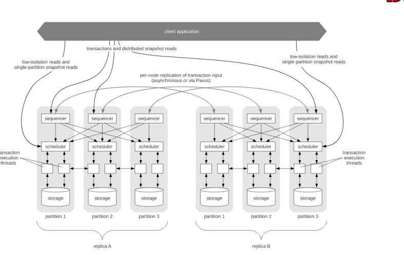
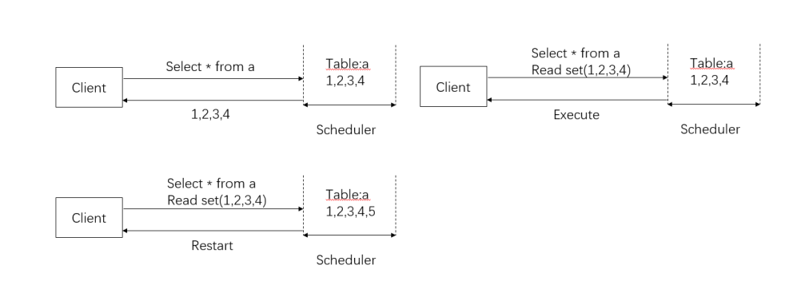
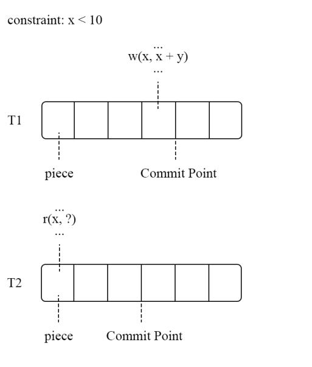
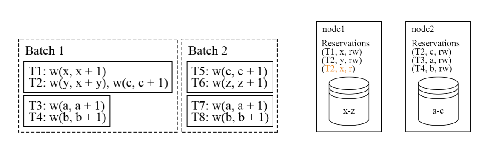
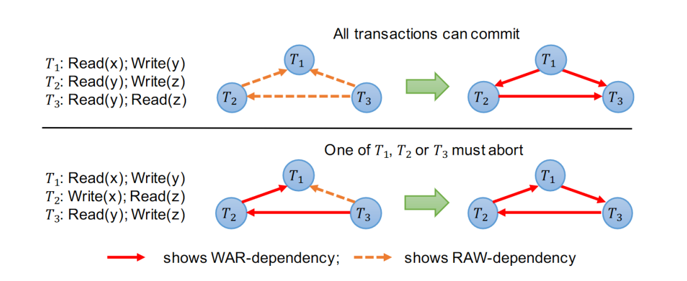

# 确定型数据库概念

确定型数据库是指在事务执行顺序确定的情况下，数据库的执行结果是唯一的。例如
$$
T_{1}<T_{2}<T_{3}
$$
那么事务执行的顺序就会按照，$T_{1},T_{2},T_{3}$的顺序进行执行。

从这个定义中我们可以看出，确定性数据库需要提前对于事务执行的顺序进行排序，那么对于事务进行排序就必须知道事务的读写集，为了去确定读写集，确定性数据库不得不为此付出许多的性能的交换，此外为了进行排序我们不得不按照一个batch的方式进行事务的执行，此特点也将成为确定型数据库的性能一大瓶颈。

但是确定型数据库也有许多好处，它在事务执行前阻止了事务的冲突，简化了事务的并发的操作，此外确定执行顺序的特点也使得数据库无需进行在副本之间进行数据的同步，副本只需要重放在主执行的事务即可。

确定型数据库起源于2008年的HStore，HStore中将所有的事务按顺序执行，这里按下不表。

# Calvin

Calvin是2012年的确定型数据库，Calvin

* sequencer..
  每10ms收集来自用户的请求，并将请求发送给对应的scheduler

* Scheduler
  执行事务，并保证确定性的结果
* storage
  一个单机的存储数据库，只需要支持KV的CRUD接口即可

* optimistic Lock Location Prediction (OLLP)

  事务被添加sequence,并被执行之前，就使用读请求，来探测这次事务所有的读写记录集，并在执行之前，再次检查，如果读写集变化了，则这个过程要重新执行。

# PWV

PWV试图通过分析事务abort的原因，将事务分为逻辑abort和系统abort。

在确定性数据库中不存在因为系统引起的abort，所以我们只需要解决逻辑引起的abort即可，PWV提出了提交点的概念，即在这个提交点之后，这个事务再也不可能被abort。

# Aria

Aria相比于Calvin，Aria将事务并发控制延后了，它依然是先在Sequnencer进行排序，但是将冲突的检测，延迟到了事务执行之后，在事务执行后会判断是否有冲突发生，如果有冲突发生，则选择事务号大的进行abort操作。

此外它还引入了一个事务重排序的概念

