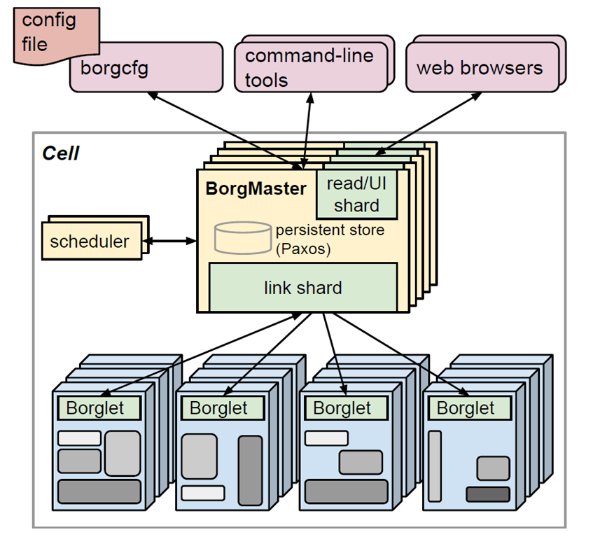
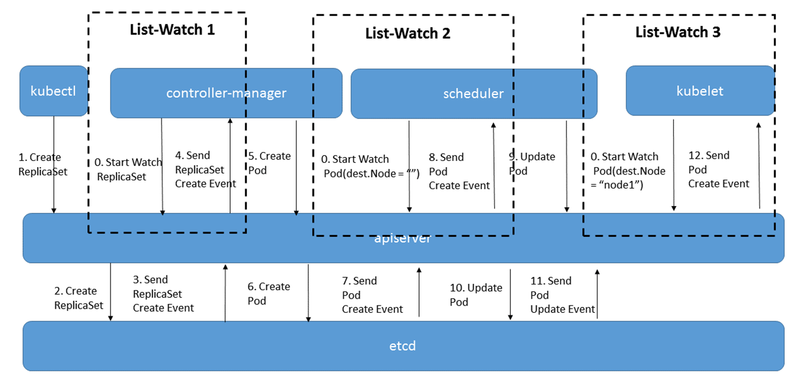

# 2022.05.20 分享纪要

- 分享人：郑前祎
- 记录人：郑前祎
- 关键词：Kubernetes, Container, 云原生
- 分享PPT: [2022-05-20-云原生基础架构—Container、Kubernetes.pdf](./slides/2022-05-20-云原生基础架构—Container、Kubernetes.pdf)

## 分享内容

### 问题描述

云原生是一种构建和运行应用程序的方法。其中的关键就是构建和运行。对于构建云原生应用程序，需要将应用程序组件化，以微服务架构构建。例如 PolarDB-X 的存算分离架构，或者是 TiDB 的存算分离架构，组件化之后就能够做到独立拓展。而对于云原生应用程序的运行，则是各个组件作为 Container 在 Kubernetes 中运行。于是引出了我们今天的主题容器和容器编排系统。

### 解决思路

#### 方向一：容器技术

**基本思路：约束和修改进程的动态表现，从而为其创造出一个“边界”。**

1. Linux Container

   使用 linux 提供的 Namespace 实现对进程的隔离，使用 cGroups 来对进程使用的资源进行限制。

2. Docker

   Docker 可以看作是对 LXC 的改进，其接管了一些内核功能来实现更完善的进程隔离机制。但真正让 Docker 能从一众容器产品中脱颖而出，其实很大程度上是得益于其对容器镜像的组织方式——Docker image。其通过镜像分层来减小传输的镜像大小。

#### 方向二：容器编排系统

**基本思路:自动部署，拓展和管理容器化应用程序的开源系统。**

1. [Large-scale cluster management at Google with Borg](https://dl.acm.org/doi/abs/10.1145/2741948.2741964)

   Borg 是 Google 从 2003 年开始的容器编排系统。从用户角度上，Borg 抽象了三种对象：job, task, alloc。从架构上，其使用 C/S 架构，由中心服务器调度所有 task。

   

2. [Kubernetes](https://kubernetes.io/docs/home/)

   Kubernetes 是直接继承于 Borg 的容器编排系统。从用户角度上，Kubernetes 抽象了三种基础对象，Container, Pod, Label，分别是 Borg 中 task, alloc, job 的延申。并且其还抽象出了更高级的对象用作管理，为每种对象都添加控制器。从架构上，其使用微服务架构和控制器模式构建核心组件，这使得整个系统变得统一而清晰，易于开发和拓展。
   
   

## FAQ

1. **Q：**cGroups 是对容器资源上限的描述？那这些资源在不使用时是否会被保留？会不会因为其它进程的占用而导致容器使用不到这些资源的上限。

   **A：**这些资源不会被保留。会出现资源被占用的情况。例如教研室集群，每位用户都具有最高权限，容器都没有使用资源限制，那么是会相互抢占的。但是，在 PaaS 场景下，容器是由云服务厂商管理的，用户只能访问容器内部。例如对于 64GB 的内存，厂商可以在其上提供 16GB 内存大小的容器供客户使用，这时不会发生资源被占用，但是厂商可以在用户负载的低谷，将这些资源用来运行自己的其它服务。

2. **Q：**PID Namespce 的隔离是不是代表着进程会有两个 PID。

   **A：**是。但是着两个 PID 不是在一个 Namespace 下的，在 Host Namespace 看，进程的 PID 是 20731；但是对于容器内部的进程，其只能看到 Container Namespace，即看到自己的进程号是 1。
