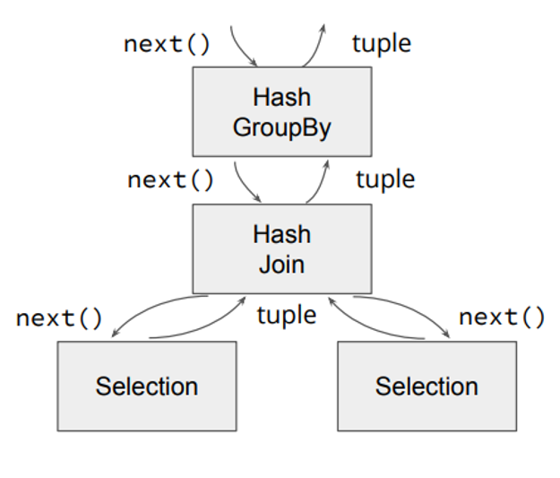
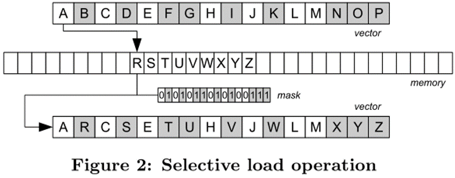
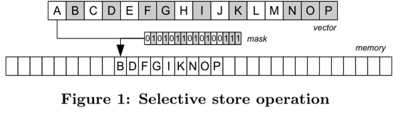
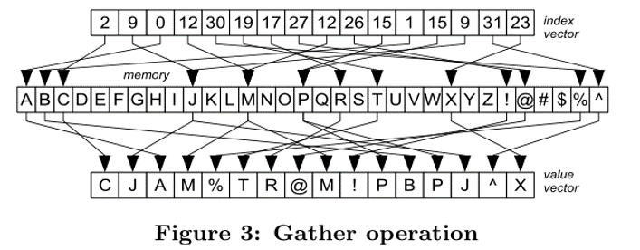
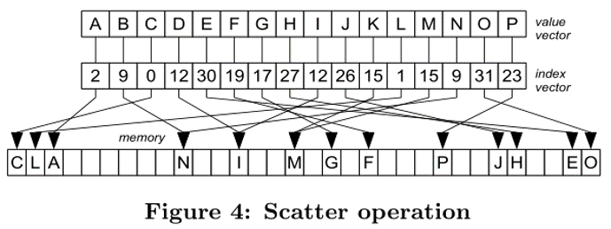
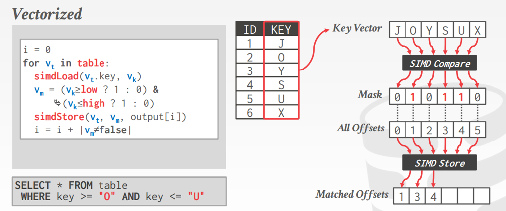
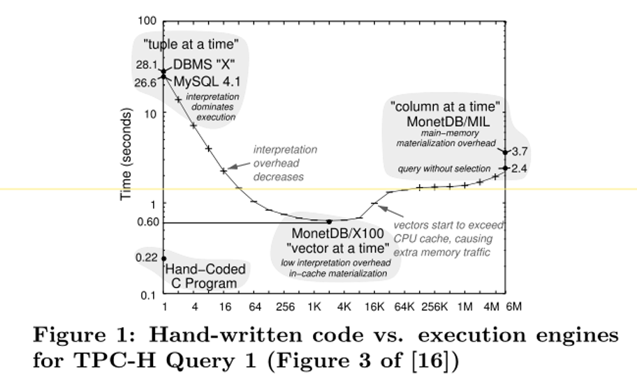
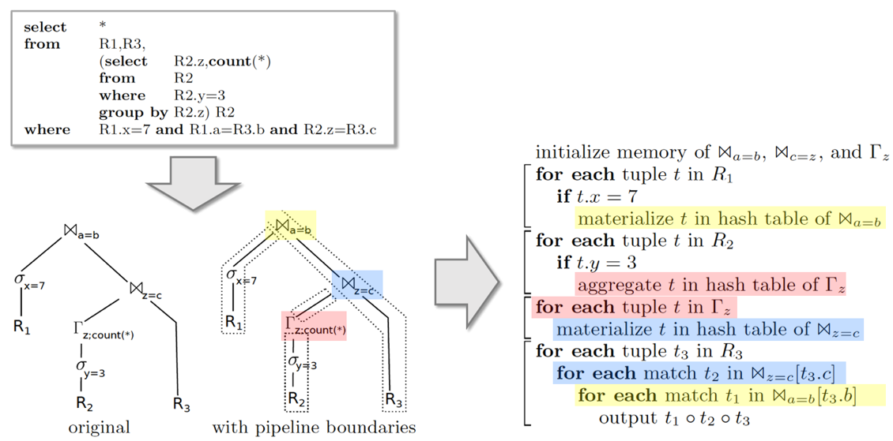
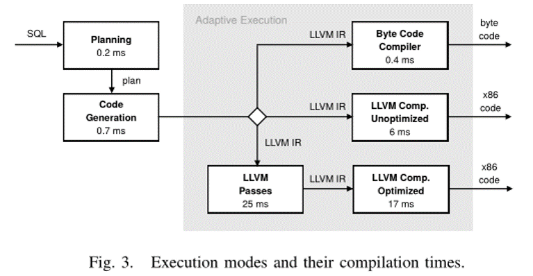

# 2022.06.04 分享纪要

- 分享人：朱道冰
- Keywords: Execution Engine, Volcano, Vectorization, Compilation
- 分享PPT: [2022-06-02-Vectorization-vs-Compilation](./slides/2022-06-02-Vectorization-vs-Compilation.pdf)

## 分享内容： Vectorization vs Execution

## 1. Execution Baground

### 1.1 Volcano

#### 特点

- Open-Next-Close
- Tuple-at-a-time
- Pull-based

<div  align="center">   </div>

#### 优点与不足

1. 优点
   1. Open-Next-Close 抽象得比较好，容易扩展，可读性强。
   2. 提出时磁盘 IO 是主要瓶颈，当时比较高效。
2. 不足
   1. Tuple-at-a-time Pipeline 不友好。
   2. Next 函数调用开销大。
      1. Tuple-at-a-time 调用次数多。
      2. Next 往往是虚函数，虚函数可能会打断 pipeline，pipeline 不友好。
   3. Tuple-at-a-time 不能利用 SIMD 指令集。
   4. Cache 利用率低。

### 1.2 CPU 快速发展

CPU 的发展符合摩尔定律，原因有：

- 制程工艺的提升
- Pipeline技术的发展

而 Volcano Execution Engine 不能充分发挥 CPU 的全部性能：Pipeline, SIMD, Cache 等。

## 2 Vectorization

Vectorization: 在原 Volcano Open-Next-Close 的基础上一次 Next 从取一个 tuple 改为取一批(vector) tuple。

### 2.1 MonetDB/X100 [01]

使用 tpc-h query 1 对 volcano 架构的 MySQL(tuple-at-a-time) 和 MonetDB/MIL(column-at-a-time) 进行性能测试和分析，提出了两者折衷的 MonetDB/X100 执行引擎(vector-at-a-time)。 因为 vector-at-a-time CPU 容易对其进行乱序执行等形成有效的 pipeline, 每个操作 primitives 所需的时钟周期有所减少。同时 vector size 大小刚好能放入 cache 中大幅提高了计算带宽。

相比 volcano, vectorization 能更好地利用 CPU pipeline 能力，cache 利用率更高。

### 2.2 SIMD [02]

Vectorization 的另一个好处是能使用 SIMD 指令，这篇工作介绍了基本的 SIMD 指令:

- selective load
  <div  align="center">   </div>
- selective store
  <div  align="center">   </div>
- gather
  <div  align="center">   </div>
- scatter
  <div  align="center">   </div>

在此基础上介绍了如何使用 SIMD(vector) 和不使用　SIMD(scalar) 的数据库基本操作的异同：

- selection scan
  <div  align="center">   </div>
- linner probe hash build & probe
- histogram & parition
- sort
- join

除了算法，附录中还给出了部分代码。

## 3 Compilation

Compilation: 直接将执行计划树按某种规则切分成小段，并转换为 task-specifc 的高级语言或者汇编代码，也叫做代码生成。

### 3.1 为什么要 Compilation (Hyper llvm basic compilation 2011 [03])

MonetDB/X100 中的 baseline 是一段手写代码，即使向量化后性能还是达不到手写代码的效果。

```cpp
static void tpch_query1(int n, int hi_date,
   unsigned char*__restrict__ p_returnflag,
   unsigned char*__restrict__ p_linestatus,
   double*__restrict__p_quantity,
   double*__restrict__p_extendedprice,
   double*__restrict__p_discount,
   double*__restrict__p_tax,
   int*__restrict__p_shipdate,
   aggr_t1*__restrict__hashtab){
   for(int i=0; i<n; i++) {
      if (p_shipdate[i] <= hi_date) {
         aggr_t1 *entry = hashtab +
            (p_returnflag[i]<<8) + p_linestatus[i];
         double discount = p_discount[i];
         double extprice = p_extendedprice[i];
         entry->count++;
         entry->sum_qty += p_quantity[i];
         entry->sum_disc += discount;
         entry->sum_base_price += extprice;
         entry->sum_disc_price += (extprice *= (1-discount));
         entry->sum_charge += extprice*(1-p_tax[i]);
}}}
```

<div  align="center">   </div>

手写代码有如下好处：

- 模糊了 operator 之间的界限，将一个 pipeline 内的操作转换到一个 for 循环内执行，代码更加紧凑。
- 一次读取就能把多个计算完成，提高了 cache 的命中率，减少了和 memory 的交互次数。

### 3.2 如何 Compilation

相比 volcano 从上往下的 pull 模式，compilation 更适用于从下往上的 push 模式，以数据为中心(data-centric) 模糊了operator 之间的界限，对执行计划树按 pipeline breaker 进行切分成多个 pipeline，每个 pipeline 单独进行 compilation 最后连接在一起。

- pipeline \
   scan, filter, hash join probe 等 operator 处理完一个 tuple 后可以直接让上层 operator 继续处理，论文中称此为 pipeline。
- pipeline breaker \
   如 hash join, hash aggregation 构建 hash table 的步骤会阻止 tuple 继续往上传，需要把结果物化到内存中，等所有 tuple 都构建完成才能继续执行上层 operator 的操作。

<div  align="center">   </div>

图源 [Coding Husky](https://ericfu.me/code-gen-of-query/#more)

上面的 pipeline 和 pipeline breaker 指导了如何切分执行计划树。论文中对每个要 compilation 的 operator 定义了 `produce()` & `consume(attributes,source)` 两个需要实现的 abstraction 从而方便拓展，使得实现更加优雅。在 compilation 时使用深度优先遍历的顺序遍历执行计划树，每个算子递归调用它的 `produce` 接口进而调用其子算子的 `produce`, 计划树最底层是 scan 算子，其没有 `consume`接口，其`produce`接口会生成 scan 逻辑的代码，然后会调用父亲算子的 `consume` 生成他们的处理逻辑代码，完成后父亲算子会递归调用其父亲节点的 `consume` 直到没有上层节点。如此往复，即可将执行计划树转换成高级语言或者汇编语言，完成代码生成的全过程。

这篇博客[Coding Husky](https://ericfu.me/code-gen-of-query/#more) 有个直观的[gif](https://ericfu.me/images/2019/03/code-gen-demo-animated.gif)。

### 3.3 Adaptive Compilation (Hyper adaptive compilation 2018 [04])

对于执行时间较长的 AP 负载，代码生成的 compilation time 相比于可能的性能提升来说往往时比较小的，是可以接受的，但是对于本身执行时间较短的 TP 负载，compilation 时间可能会比执行时间还长。
<div  align="center">   </div>
争对这个问题，Hyper 实现了一种 adaptive compilation，根据不同负载选择不同的执行模式。为此 Hyper 首先实现了基于 vm 的 bytecode 解释执行模式，这种模式需要的编译时间很短，是所有 query 的默认执行模式。Hyper 使用 morsel-driven 的并行执行框架将 pipeline 按照输入切分，分成不同小任务以方便并行和模式切换。Hyper 会对 pipeline 多进程的执行平均速率，剩余 tuple 数量等进行监控，定时对不同模式完成该 pipeline 剩余任务所需时间进行估计，选择所需最小时间的模式并在 thread 运行新的 morsel 时转换模式，如从 bytecode 解释运行转换为 compilation 模式。 注意 compilation 过程需要时间，此期间进程仍然可以以 bytecode 的模式处理。

```cpp
// f: worker function
// n: remaining tuples
// w: active worker threads
extrapolatePipelineDurations(f, n, w):
	r0 = avg(rate in threadRates)
	r1 = r0 * speedup1(f); c1 = ctime1(f)
	r2 = r0 * speedup2(f); c2 = ctime2(f)
	t0 = n / r0 / w
	t1 = c1 + max(n - (w-1)*r0*c1, 0) / r1 / w
	t2 = c2 + max(n - (w-1)*r0*c2, 0) / r2 / w
	switch min(t0, t1, t2):
		case t0: return DoNothing
		case t1: return Unoptimized
		case t2: return Optimized
```

## 4 Vectorization vs Compilation [05]

MonetDB(VectorWise) 和 Hyper 的作者 以及 CMU的 Andy Pavlo 等为了对比这两种具有共同目标而方向又截然不同的 Execution 方案的优缺点及适用场景。因为这些系统有很多独有的特殊优化，他们实现了 Tectorwise(VectorWise) 和 Typer(Hyper) 这两个原型，除了 execution 架构上，其余实现上尽可能相同，如 operator 的算法等。

对 Single-Threaded Performance, SIMD, INTRA-QUERY PARALLELIZATION, HARDWARE, Compilation Time 等方面进行了实验对比。得出了以下结论：

|    Vectorized vs. Compiled   |                                                        分析                                                        |
|:----------------------------:|:------------------------------------------------------------------------------------------------------------------:|
|      Computation   ( < )     | 编译执行对computation为主的queries更适合，因其代码更紧凑，能在寄存器中一次性把相连的计算完成，减少了和内存的交互。 |
| Parallel   data access ( > ) |    向量化执行更适合需要并行访问大量data的queries（如hash join为主），因其每个vector能构建有效的CPU   pipeline。    |
|         SIMD   ( = )         |                    向量化执行的SIMD收益在实际中有限，因现实中大多数operator都是memory-bound的。                    |
|    Parallelization   ( = )   |                                                 都能利用好多核CPU。                                                |
|  Hardware   platforms ( = )  |                                            在不同架构的CPU上两者各有胜负                                           |
|     Compile   time ( > )     |       向量化执行的primitives在编译时就完成，不需要在运行时编译，如何减少编译执行的编译时间是一个重要研究点。       |

## Reference

[01] - [Boncz P A, Zukowski M, Nes N. MonetDB/X100: Hyper-Pipelining Query Execution[C]//Cidr. 2005, 5: 225-237.](http://cidrdb.org/cidr2005/papers/P19.pdf) \
[02] - [Polychroniou O, Raghavan A, Ross K A. Rethinking SIMD vectorization for in-memory databases[C]//Proceedings of the 2015 ACM SIGMOD International Conference on Management of Data. 2015: 1493-1508.](http://www.cs.columbia.edu/~orestis/sigmod15.pdf) \
[03] - [Neumann T. Efficiently compiling efficient query plans for modern hardware[J]. Proceedings of the VLDB Endowment, 2011, 4(9): 539-550.](https://www.vldb.org/pvldb/vol4/p539-neumann.pdf) \
[04] - [Kohn A, Leis V, Neumann T. Adaptive execution of compiled queries[C]//2018 IEEE 34th International Conference on Data Engineering (ICDE). IEEE, 2018: 197-208.](https://db.in.tum.de/~leis/papers/adaptiveexecution.pdf) \
[05] - [Kersten T, Leis V, Kemper A, et al. Everything you always wanted to know about compiled and vectorized queries but were afraid to ask[J]. Proceedings of the VLDB Endowment, 2018, 11(13): 2209-2222.](https://www.vldb.org/pvldb/vol11/p2209-kersten.pdf) \
[05] – [参考博文链接汇总](https://www.one-tab.com/page/LmMkDhRhRWKUxU2bRRJgQA) \
[06] – [CMU 15-721 2020](https://15721.courses.cs.cmu.edu/spring2020/)  \
[07] - [PingCAP Infra Meetup No.98 Compiled and Vectorized Queries](https://www.bilibili.com/video/BV1zb411G7ay/)
