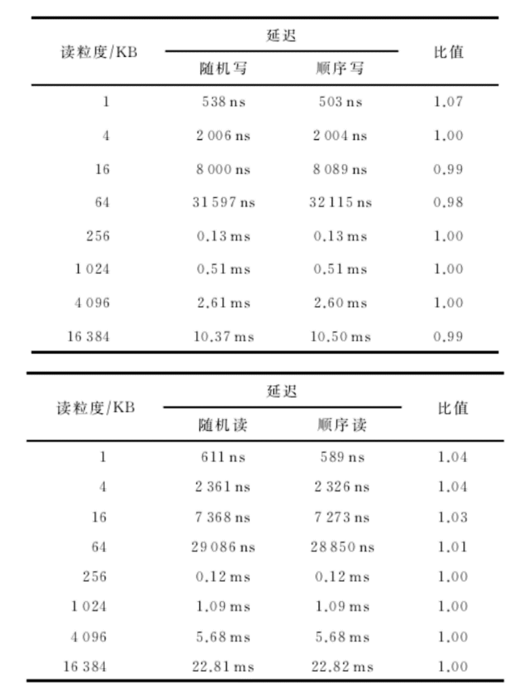
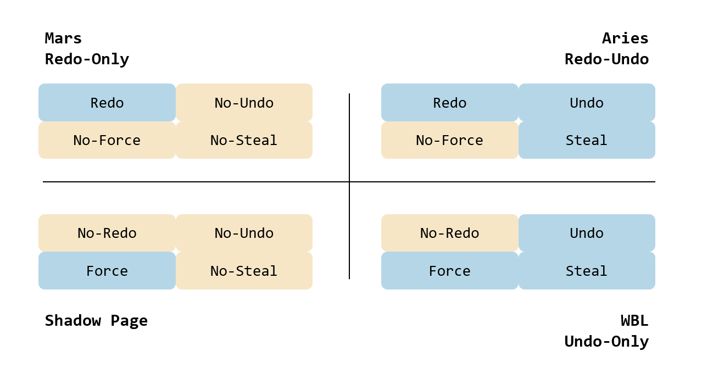

# 2022.06.17 分享纪要

- 分享人：dcs
- 关键词: Aries、MARS、WBL
- 分享PPT: [2022-06-17-面向NVM的数据库故障恢复机制](./slides/2022-06-17-面向NVM的数据库故障恢复机制.pdf)

## 分享内容： 故障恢复机制

## 1. 为什么需要故障恢复机制

事务需要在出现故障的情况下依旧保持A、D的特性，所以需要故障恢复机制，那么，有哪些？

### 1.1 Shadow page

其实就是读写在单独的新复制的页面中，然后事务提交的时候原子性的更改指针到新的页面上。

### 1.2 Aries

见[这里](./2020-09-25-Aries.md)

## 2 NVM特点

- 整体性能与DRAM接近

- 随机读写与顺序读写差别不大

- 可字节寻址

### 2.1 原有问题

- No-Force And Steal
  - 需要维护redo、undo，加之原数据，造成三倍写放大，换来的是磁盘的顺序写性能
- Page管理方式
  - 基于持久化设备为块设备，且顺序写远大于随机写，面对随机设备NVM可否有其他高效的方式？

### 2.2 优化思路

## 3 优化

MARS

Write-Behind Logging

详见PPT

## 4 总结

|           | **思路**                                                  | **优点**                                                     | **缺点**                                       |
| --------- | --------------------------------------------------------- | ------------------------------------------------------------ | ---------------------------------------------- |
| **Aries** | 1.Redo-undo模式  2.Fuzzy  checkpoint  3.No-force  + Steal | 1.接口丰富，适合绝大多数场景  2.Redo  + Undo获得最大程度并发量 | 1.实现较为复杂  2.写入放大较高                 |
| **MARS**  | 1.Redo-only模式  2.软硬件协同实现  3.No-force  + No-steal | 1.多个Logger模块并行加速写入  2.Redo日志可编辑，压缩日志空间 | 1.硬件设计复杂  2.是否需要引入double write机制 |
| **WBL**   | 1.Undo-only模式  2.Group  commit  3.Force  + No-steal     | 1.日志量极少  2.恢复时间少  3.充分利用NVM特点                | 1.可见性较复杂  2.对垃圾回收要求高             |

## 参考文献

1.http://catkang.github.io/2019/01/16/crash-recovery.html

2.https://courses.cs.washington.edu/courses/cse550/09au/papers/CSE550.GrayTM.pdf

3.https://cs.stanford.edu/people/chrismre/cs345/rl/aries.pdf

4.https://jianh.web.engr.illinois.edu/papers/jian-vldb15.pdf

5.http://mesl.ucsd.edu/pubs/SOSP2013-MARS.pdf

6.https://www.vldb.org/pvldb/vol10/p337-arulraj.pdf

7.https://github.com/CDDSCLab/Weekly-Group-Meeting-Paper-List/blob/main/meeting-summary/2020-09-25-Aries.md
