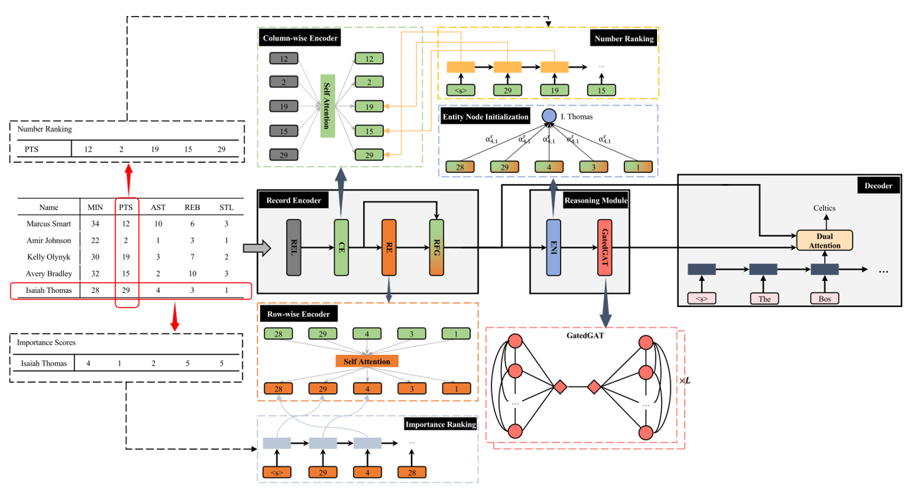

# 2020.09.25 分享纪要

- 分享人：石微微
- 关键词：自然语言生成、表格生成文本、逻辑生成
- Keywords: NLG, Table-to-Text, Logic Generate
- 分享PPT: [2022-07-08-Table-to-Text](./slides/2022-07-08-Table-to-Text.pdf)

## 分享内容： 表格生成文本

## 数据集

- RotoWire
   输入：三个表格，包含两个球队整体表现的记录、有关球员在主队的表现以及球员在客队的表现
   输出：一段对比赛情况的描述
- WikiBio
   输入：维基百科的infobox
   输出：传记的第一句话
- WeatherGOV
   输入：温度、天空条件等的结构化表示的记录
   输出：天气预报
- ToTTo
   输入：一个表格，表格标题信息，一组突出显示的单元格
   输出：描述突出显示的单元格的句子
- LogicNLG
   输入：一个表格
   输出：包含表格内容的一个带有逻辑推理的句子
- Logic2Text
   输入：一个表格，一个逻辑形式
   输出：该逻辑形式对应的句子

|      Data Set      |   Domin   | Table | Examples |     Sourse      |
| :----------------: | :-------: | :---: | :------: | :-------------: |
| WeatherGOV（2009） |  Weather  | 22.1K |  22.1K   | www.weather.gov |
|  WikiBio（2016）   | Biography | 728K  |   728K   |    Wikipedia    |
|  RotoWire（2017）  |    NBA    | 4.9K  |   4.9K   |    Rotowire     |
|   ToTTO（2020）    |   Open    | 136K  |   136K   |    Wikipedia    |
|  LogicNLG（2020）  |   Open    | 7.3K  |  37.0K   |    Wikipedia    |
| Logic2Text（2020） |   Open    | 5.5K  |  10.7K   |    Wikipedia    |

## 评估方法

1. 相似度评估：BLEU-1，2，3
2. 逻辑保真度评估：
   - 基于IE抽取式的评估
   - 基于解析的评估
   - 基于NLI的评估
   - 对抗性评估

## 方法

### 1.由粗到细的方法

- 第一阶段：生成一个确定全局逻辑结构的模板
- 第二阶段：根据第一阶段生成的模板生成最终的、有根据的句子

### 2.基于关系实体图的方法（针对RotoWire数据集）

1. 记录编码器

   利用两个自注意力模块分别从列和行维度对每个记录的上下文进行建模。之后，通过记录融合门获得记录的融合表示。
   - 记录编码REL：用四个元组来表示每个记录。这四个元组包括：实体（球队或球员的名称，例如 Carmelo Anthony）、类型（例如 PTS）和值以及特征（例如，主场或客队）。利用 1 层 MLP 将每条记录的四种信息的嵌入编码为密集向量。
   - 列式编码CE：为了捕捉记录之间的数值大小关系，采用自注意力模块在同一列中的其他记录的上下文中对记录进行建模，并获得列维度表示向量。引入大小排序（Number Ranking）。
   - 行式编码RE：考虑到列式编码捕获的大小关系可能有助于学习行级别的重要性关系，将列式编码和行式编码串联起来 。使用另一个类似于列式编码的自我注意模块来获得记录的行维表示。引入重要性排序（Importance Ranking）
   - 记录融合门RFG：连接记录的二维表示并利用 MLP 来获得它的一般表示。将列维度表示和行维度表示与其进行比较以获得其重要分数。将行列维度表示及其重要分数通过加权和获得融合记录表示。

2. 推理模块

   通过实体节点初始化模块 (ENI) 获得表中每个实体的初始化表示。考虑到同一行的不同记录可能贡献不同，通过注意力机制将它们动态组合。
   在获得实体的初始表示后，采用图神经网络将实体节点信息传播给它们的邻居。将门机制结合到信息聚合中，以滤除相邻节点的噪声并提取有用信息，我们将其命名为 GatedGAT。

3. 解码器

   为了利用记录级和行级语义信息，采用双重注意力机制。

### 3.多样性增强的方法

Table-to-Text任务的关键特征：

1. 多样性：对于单一的输入产生不同的假设集
   - 基于逻辑类型控制：多样性较强
   - 基于解码技术：多样性较弱
2. 可控性：因为大量不同的有效语句可能差异很大，可能会提示用户需要提供语句类型的子集或特定分布。

具体实现：

- (a) 对DEVTC进行训练，使其根据类型分类器预测的逻辑类型生成语句
- (b) DEVTC可以接收一个表和多个逻辑类型，从而支持为单个表生成不同的语句集

### 4.基于分解的方法

1. 语句分解

   - 程序采集：使用LPA算法将陈述解析为候选程序
   - 分解类型：通过省略所选程序中的参数来提取程序骨架，按照程序骨架进行分组，以识别四种主要的分解类型：连接、比较、最高级、唯一
   - 分解模板：设计一些与每个分解类型相关联的简单模板。通过这种方式，可以构造伪分解，包括子语句和子问题

2. 学习分解

   - 分解类型检测：基于 BERT 训练五路分类器来识别语句是否可分解，如果是，它属于哪种分解类型
   - 分解模型：微调的GPT-2模型

3. 解决子问题

   使用在WikiTableQuestions数据集上的微调TAPAS模型得到子问题的答案，然后以成对的方式将子问题及其答案组合起来，得到中间证据E

4. 重组中间证据

   将证据 E 与陈述 S 和表 T 融合在一起，采用门控注意力模型来获得聚合证据表示并预测最终标签

用于表格生成文本任务：

先生成简单事实，再生成带有逻辑推理的句子。

## Reference

- https://arxiv.org/pdf/2004.10404.pdf
- https://aclanthology.org/2021.acl-long.466.pdf
- https://arxiv.org/pdf/2205.10938.pdf
- https://arxiv.org/pdf/2109.11020.pdf