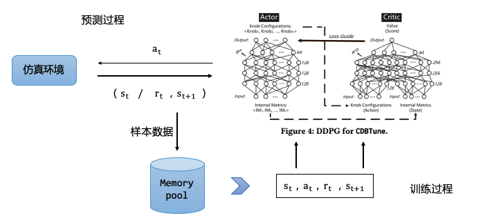

# 数据库之智能调参

- 时间：2022.08.26
- 分享人：周帆
- 关键字：AI4DB，智能调参，OtterTune，CDBTune，Hunter，QTune
- 分享PPT: [2022-08-26-数据库之智能调参](./slides/2022-08-26-数据库之智能调参.pdf)

## 分享内容

### 问题描述

数据库存在上百个参数，不同工作负载对应着不同适配的参数配置，所以调参的**目标在于同时优化资源使用率和性能。**本次分享对当前主流的智能调参模型做一个详细的分析并总结其优缺点。

### 调参模型

#### 一、OtterTune

- 核心思想：收集历史数据，并使用模型学习以往经验，实现自动化调优
- 主要步骤：
  1. 去掉冗余工作负载
  2. 选择最具影响力的旋钮
  3. 将目标工作负载映射到已有工作负载
  4. 推荐旋钮设置

- 优点：
  1. 利用大量历史数据
  2. 几乎不需要人工参与
  3. 能够适应不同的数据库管理系统

- 缺点
  1. 所采用的训练模型都是流水线模型
  2. 过度依赖大规模高质量训练样本
  3. 无法在高维连续空间中推荐合理的配置，存在次优情况

参考文献：[Automatic database management system tuning through large-scale machine learning](https://dl.acm.org/doi/pdf/10.1145/3035918.3064029)

#### 二、CDBTune

- 核心思想：放弃机器学习，引入深度强化学习，实现端到端自动调优系统

- 优化点
  - 采用试错法，以有限的样本数学习最佳旋钮
  - 利用深度确定性策略梯度法在高维连续空间中寻找最优配置（DDPG）
  - 设计了一个有效的奖励函数，代替传统回归
  
- DDPG
  
  

- 优点
  1. 化繁为减，实现的是一个端到端的推荐
  2. 自我学习，探索各种可能的调参动作
  3. 减小陷入局部最优的可能性
- 缺点
  1. 冷启动，需要初始化生成负载进行训练，导致调优时间大大增加
  2. 只支持粗粒度调优（只读，只写，读写），不支持细粒度的调优（select，update等）

参考文献：[An end-to-end automatic cloud database tuning system using deep reinforcement learning](https://dbgroup.cs.tsinghua.edu.cn/ligl/papers/sigmod19-cdbtune.pdf)

#### 三、Hunter

- 待解决问题
  - 训练初期，调优效果差，收敛速度慢（冷启动）
  - 搜索空间大，网络结构复杂（模型优化）
- 目标
  - 在没有任何数据的情况下短时间内推荐最优配置（在线调优系统）
- 优化点
  1. 克隆CDB实例，以此并行进行压力测试，同时，采用GA算法，以此生成高质量的样本
  1. 参照OtterTune，采用PCA降维，并利用随机森林给Knob排序
- 优点
  1. 利用并发压力测试，解决冷启动问题，显著缩短在线调优时间
  2. GA算法短时间内生成高质量样本，提高DDPG调优效果
- 缺点
  1. 难以快速判断性能是否达到“最优”，目前需要额外的时间判断

#### 四、QTune

- 待解决问题
  - CDBTune只提供粗粒度的调优（读写级别调优），不能提供细粒度调优（OLTP、OLAP级别的调优）
- 目标
  - 在没有任何数据的情况下短时间内推荐最优配置（在线调优系统）
- 优化点
  1. QTune 提供三种数据库调优粒度：查询级、工作负载级和集群级调优
  2. 加入SQL查询信息，提出一种双状态深度确定性策略梯度 (DS-DDPG) 模型
- 优点
  1. 提供细粒度调优，提高调优性能
- 缺点
  1. 训练时间太长，模型复杂

参考文献：[Qtune: A query-aware database tuning system with deep reinforcement learning](https://www.cl.cam.ac.uk/~ey204/teaching/ACS/R244_2020_2021/papers/li_VLDB_2019.pdf)

