# 表格开领域问答

- 分享人：陈思芹
- 记录人：陈思芹
- 关键词：Open-domain QA, Table Retrieval
- 分享PPT: [2022-09-09-表格开领域问答.pdf](https://github.com/Sunlly0/Weekly-Group-Meeting-Paper-List/blob/main/meeting-summary/slides/2022-09-09-表格开领域问答.pdf) 

# 分享内容

## 1. 背景

### 任务定义

Open-domain QA 即开领域问答，往往只给定了一个大型的数据源，比如百万级的文档或者大型知识库，通过搜索出和问题相关的内容并提取答案。

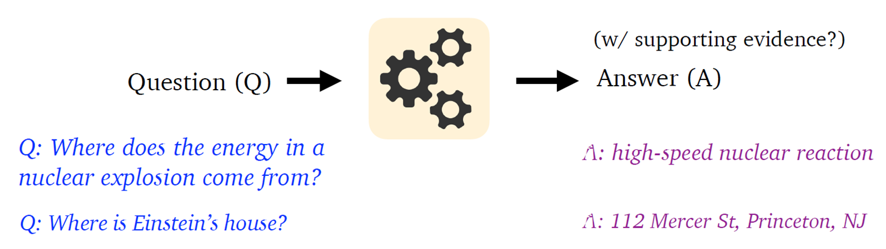

### 发展历史

 20 世纪 60 年代， 开始QA 系统的研究，应用在体育和学术研究领域。

1999 年，TREC 会议提出了 OpenQA 任务的定义，开启了 Open-domain QA 的先河。

### 框架发展

由于自然语言处理能力的限制，早期的开领域问答框架是以三阶段为主的。

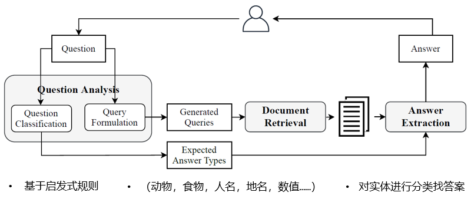

随着深度学习技术的发展，比如 CNN 和 LSTM 的出现， OpenQA 有了很大的发展，比如基于 CNN 的分类器使得问题分析中的分类准确性有了很大的提升，同时，神经网络模型使得答案提取阶段有了突破的进展。

2017年，DrQA 提出了两阶段的 Retriever-Reader  框架，成为开领域问答中的主流。

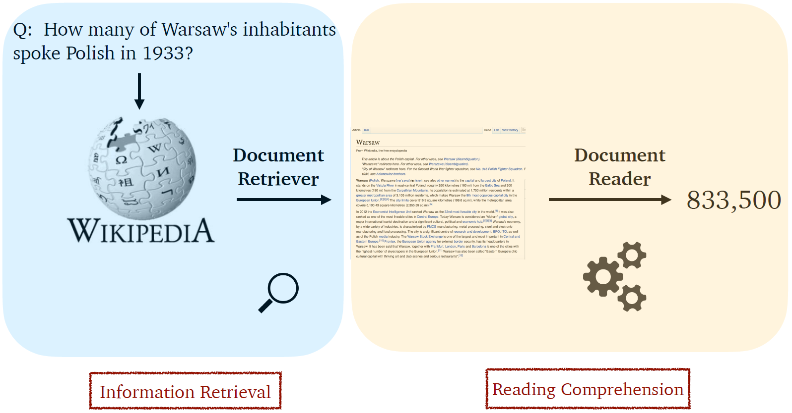

新框架：Retrieval Free。比如 T5，经过训练后的 T5 可以直接跳过检索阶段，直接生成答案。 目前还不太完善，但也为开领域任务提供了一个新的思路和探索方向。

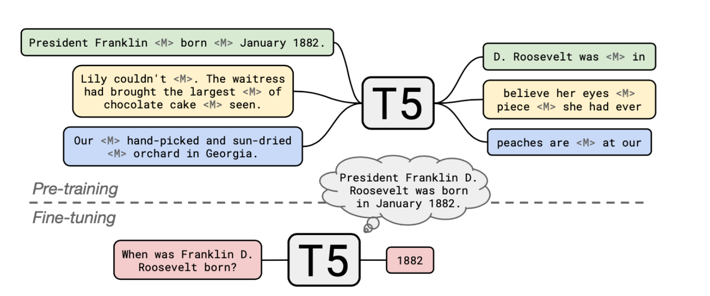

### 问答任务分类

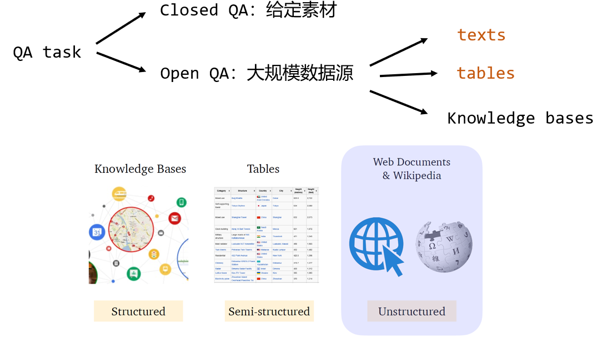

## 2. 检索部分

### **TF-IDF**

TF-IDF 是一个加权技术，可以用来衡量一个字词对于文档的重要程度。

- TF(Term Frequency)，也称为词频。即某个词在文档中出现的次数。考虑到不同文档的长度是不一样的，将实际的次数除以文档的总词数进行标准化：
  
    
    
- IDF(Inverse Document Frequency)，也称为逆文档频率。用于衡量一个词在语料库中的稀有程度。
  
    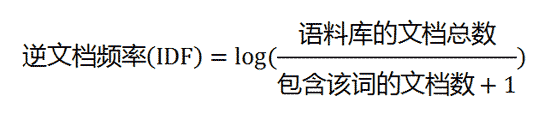
    

TF-IDF 的计算：将TF 和IDF 相乘

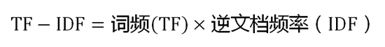

可以看到，**TF-IDF与一个词在文档中的出现次数成正比，与该词在整个语言中的出现次数成反比**。

### **BM25**

BM25（BM：best matching）算法是一种计算句子与文档相关性的算法。先将输入的句子分词，然后计算句子中每个词与文档的相关性，最后进行加权求和，得到句子和文档的相关性评分。

计算公式如下：

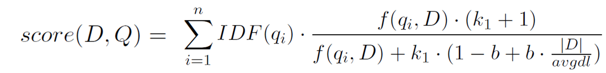

- D: 文档， Q：问句
- $q_i$：问句中的各个分词
- $IDF (q_i)$，该词的逆文档频率。
  
    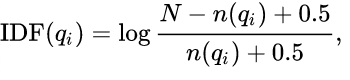
    
- $f(q_i,D)$，即TF，该词在文档中的词频。

BM25洞察到：词频和相关性之间的关系是非线性的，具体来说，每一个词对于文档相关性的分数不会超过一个特定的阈值，当词出现的次数达到一个阈值后，其影响不再线性增长，而这个阈值会跟文档本身有关。

对于词频做了”标准化处理“:

- k1：自由参数，默认1.2。是一个取正值的调优参数，用于对文档中的词项频率进行缩放控制。如果 k 1 取 0，则相当于不考虑词频，如果 k 1取较大的值，那么对应于使用原始词项频率。
- b：自由参数，默认0.75。调节参数 （0≤ b≤ 1），决定文档长度对缩放的影响：b = 1 表示基于文档长度对词项权重进行完全的缩放，b = 0 表示归一化时不考虑文档长度因素。
- |D|：文档长度
- dl：整个文档集的平均长度

### 倒排索引

倒排索引是一个加快检索的机制。

对于语料库中的每一篇文档，我们可以提取出文档的关键词。在建立倒排索引后，我们将文档-关键词的对应关系，转换成关键词-文档的对应关系。

在查找的时候，我们通过提炼问句关键词，以倒排索引为跳板来找到对应的文档，这样就可以大大加快检索速度。

### **DPR**

Karpukhin et al., 2020. Dense Passage Retrieval for Open-Domain Question Answering

**问题：**

TF-IDF 和 BM25 算法属于传统的稀疏向量模型，在检索中它们仅考虑了词的匹配，而没有考虑到语义的相关性。同时，检索器是不能针对特定的语料和应用领域学习训练的。

**方法：**

通过两个 BERT 模型分别对句子、段落进行编码，输出能代表它们语义信息的隐藏层向量；再计算向量的内积得到相似得分。

DPR 采用了微调的方式来进行训练，而不用再进行繁琐的预训练。我们利用训练标签数据（q,p）训练BERT 双编码器，使得正确的问句-段落得到的向量内积尽可能高，而不相关的问句-段落的向量内积尽可能低。定义了一个损失函数，参与其中计算的包括了一个positive 段落和若干个 negative 段落。

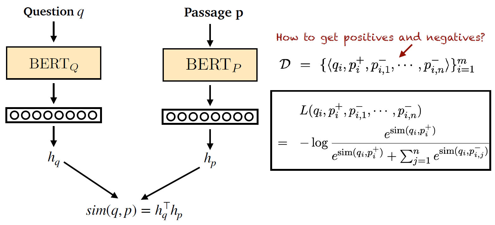

在完成 DPR 的训练后，通过负责段落的BERT模型对整个语料库中的段落进行编码，并载入 FASSI 检索库中，对于后续需要检索的一个问句，只需要用BERT编码成向量后，并与检索库中的密集向量比对，就能检索出相似性较高的段落。

**提取答案**

利用在阅读理解数据集上微调后的 BERT 模型作为 Reader ，以预测 Span 的方式来得到答案。完成开领域问答的全部过程。

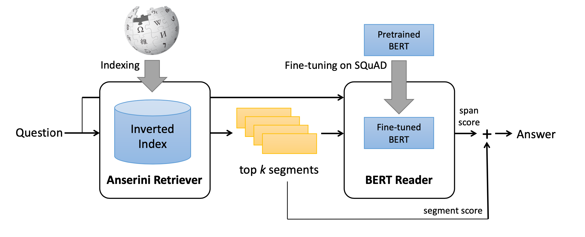

## 3. 表格开领域问答

问题：

表格存在一定的结构，表格中的行和列中的内容有着一定的统一格式和内在的相关性。

BERT 预训练模型对文本的编码取得较好的效果，但缺乏对表格结构信息的理解。

### DTR

2021，Open Domain Question Answering over Tables via Dense Retrieval

在DPR 之后，提出了DTR（dense table retriever）。DTR 的检索流程与 DPR 有着较大的相似性，都使用了预训练模型将问句和表格编码成为向量。在预训练模型的选取上，DTR 将 BERT 替换成针对表格的预训练模型 TaPas。

基于 DTR 的表格开领域问答模型，涉及到了 3 个不同的 Tapas  预训练模型。Tapas_q 将问句编码为向量，Tapas_T 将表格编码为向量，通过计算向量的内积能得到问句与语料库中的任意表格的相似度。在此之后，我们将相似度最高的 Top_K个表格输入到后续的 Table QA 阶段，通过 Tapas_r  实现和闭领域 QA 近似的单元格选取过程。得到最后的答案。

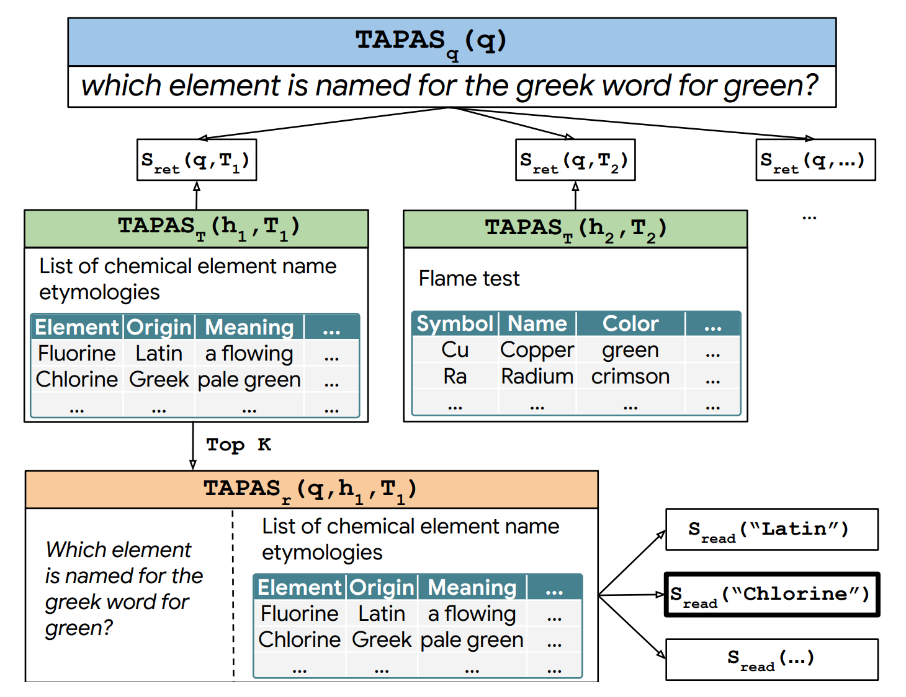

在训练中，为了适应表格检索的场景，DTR 对 Tapas 进行了重新的预训练来得到一个密集向量检索器。

### 表格检索有必要使用专门针对表格的模型设计吗？

问题：

 DTR 的缺陷的：

- Embedding太复杂，在检索是非常强调内容的情形下，提升效果不佳。
- DTR 需要额外的预训练步骤，导致了训练流程过于繁琐。

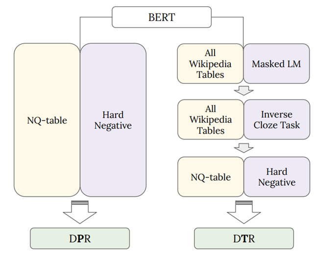

假设：经过适当训练的基于文本的检索器甚至可能超过基于表格的检索器，因为文本检索数据集上学习的强大内容匹配的能力，可以转移到表格检索任务上。

实验：对比了 DPR 和 DTR ，DTR 仅在 NQ-table 上进行了训练；而 DPR-table 则是基于检查点继续在 NQ-Table 上做微调，结果显示了DPR-table 较 DTR 在 top-k 的 k 取较小值时的效果好。说明基于文本的检索器是有潜力达到和针对表格设计的检索器接近的检索效果。

为了进一步论证针对表格的模型设计是否有必要，

第一个实验的目的是探究是否只使用线性化的输入也可以在一定程度上体现表格结构，比如：

- 随机打乱表格行列顺序后才输入，检索性能是否有一定下降？
- 增加行列间的分隔符，检索性能是否有一定提升？

第二个实验的目的是探究对表格做额外的结构编码是否可以提升表格的检索效果。设计了三种不同的表格编码方式：

- 增加 row/column 编码
- 使用 Hard attention mask 表明单元格之间是否有行列关系
- 使用 Soft attention **bias** 表明单元格之间的不同种类关系

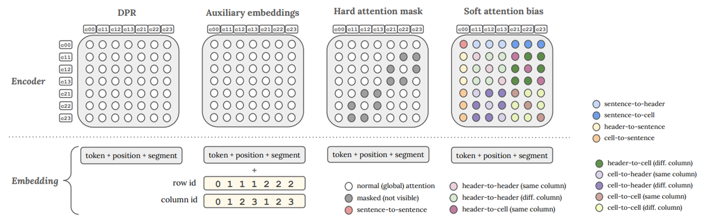

经过实验和实验结果分析后，作者得出了如下的结论：

- 当打乱行列间顺序，尤其是打乱了同行的单元格的顺序后，检索效果变差。说明文本检索器能通过线性化一定程度上捕捉到表格的结构模式。
- 当增加行列间分隔符后（单元格之间加“|”，行结尾加“.”），检索效果有明显提升。
- 针对表格的额外编码的三种方法，均对检索效果的提升微乎其微。

总结以上几点，作者认为在表格检索中，针对表格的复杂模型设计可能没有必要。可以用增加间隔符这样的简单方法，使针对文本的 Retriever 达到类似的学习表格结构的效果。

## 4. 论文工作

问题：

类似 DTR 这样对于表格结构的复杂编码，在表格检索时，并不一定较 DPR 加入简单的分隔符效果好。同时，使用弱监督训练的 Tapas 做答案提取，需要将整个表格输入到模型中，对于表格自身的大小有很大的限制。

因此，在自己的论文中，提出了运用表格的 Schema 信息增强了表格检索的准确性。

论文工作：

- 开领域 Text-to-SQL 任务探索。
- 将原本在闭领域Text-to-SQL Decoding 阶段使用的执行引导机制，引入开领域表格问答的检索阶段，实现表格检索的强化。
- 将原本的 Text-to-SQL 数据集 WikiSQL 转换成为开领域的 Open-domain WikiSQL，作为训练数据和结果验证。

下面是基于Text-to-SQL的表格开领域问答的一个框架。在 Retrieval Stage 和 Extract Answer Stage 之间，有一个执行结果的回溯，这就是执行引导。实际操作的时候，由于计算资源的有限，论文只在重新排序(re-ranking)阶段应用执行引导机制。

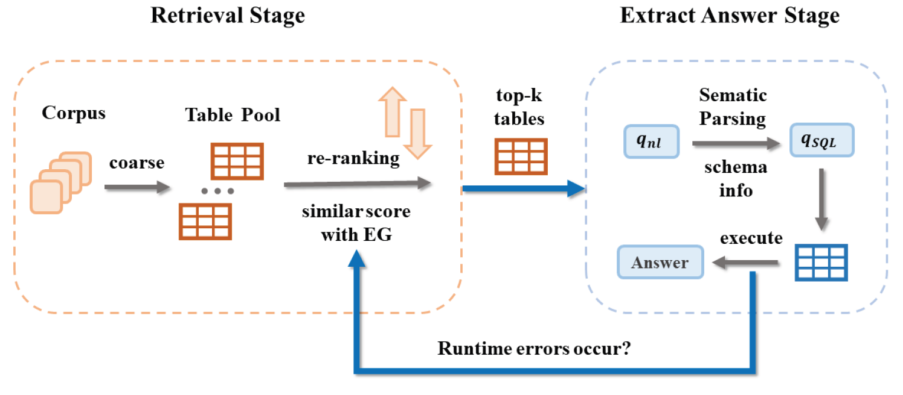

实验结果表明，利用了执行引导，DPR在小范围的精确检索中有极大的提升。

在开领域Text-to-SQL 的实验结果中。引入了执行引导后，逻辑形式准确率上升至 75.2%，而答案的准确率高达 80%，达到了能基本可以用于实际应用中的性能。

### 局限性

虽然执行引导能大幅提升表格检索的准确性，但它存在局限：一是由于利用了schema 信息作为检索正确性的度量，对表格schema 信息的完整性有较高的要求。考虑到一些 web 表格有可能没有包含详细的模式信息，执行引导在这种情形下就无法充分发挥出效果。

第二，模型在转换和执行SQL需要一定的时间成本和计算资源，因此，粗检索步骤中的 table pool size 会受到限制，这可能导致检索结果的不准确。

最后是该方法目前只适用于简单的SQL 问句和单表检索的情况，要让执行引导的方法适用于更复杂的情况，还需要未来的进一步探索。
