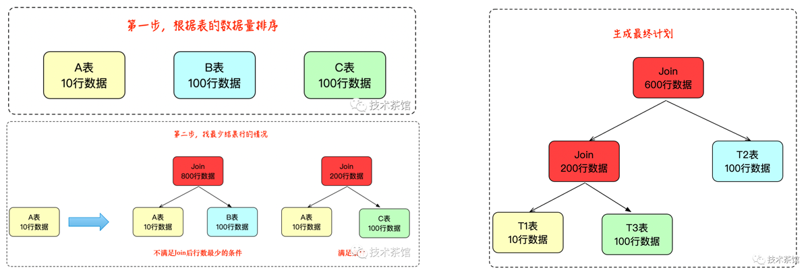
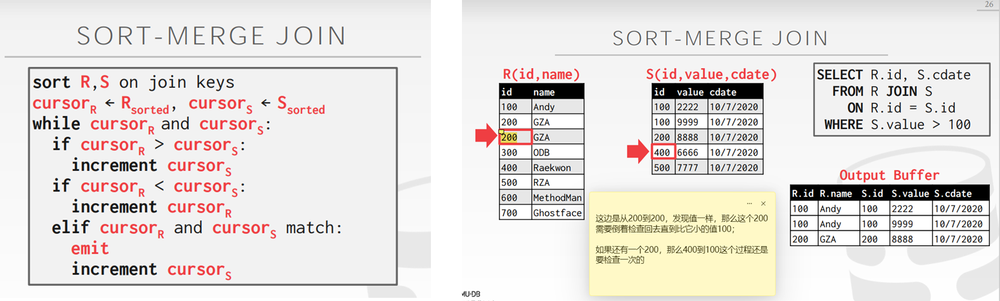

# 2022.09.19 分享纪要

- 分享人：朱道冰
- Keywords: Logical /Physical Query Optimization, Execution Engine
- 分享PPT: [2022-09-19-查询优化概述](./slides/2022-09-19-查询优化概述.pdf)

## 分享内容：查询优化概述

### 一、查询优化背景

#### 1.1 SQL语句

##### 声明式SQL语句

用户只需说明他们想做什么，具体的执行方式由数据库系统决定，这部分工作主要由数据库系统中的查询优化模块完成，不同的执行计划的执行耗时可能天差地别，查询优化模块的好坏也是一个数据库的核心卖点。

##### SQL语句分类

> 1.数据操作语言(DML：Data Manipulation Language)
>
> 由数据库管理系统(DBMS) 提供，用于让用户或程序员使用，实现对数据库中数据的操作。 主要包含 **SELECT**、 INSERT、 UPDATE、 DELETE、 MERGE、 CALL、 EXPLAIN PLAN、 LOCK TABLE等语句。
>
> 2.数据定义语言(DDL：Data Definition Language)
>
> 用于定义SQL模式、基本表、视图和索引的创建和撤消操作。 主要包含 CREATE、 ALTER、 DROP、 TRUNCATE、 COMMENT、 REPLACE(RENAME)等语句，一般不需要commit等事务操作。
>
> 3.数据控制语言(DCL：Data Control Language)
>
>  用于数据库授权、角色控制等管理工作。 主要包含 GRANT、 REVOKE等语句。
>
> 4.事务控制语言(TCL：Transaction Control Language)
>
>  用于数据库的事务管理。 主要包含 SAVEPOINT、 ROLLBACK、 COMMIT、 SET TRANSACTION等语句。

SQL语句主要有四种类型，其中比较耗时，需要查询优化的是**SELECT**语句。

#### 1.2 关系模型

刚开始SQL语句是基于关系模型的关系型数据库提出的，关系模型也就是我们熟悉的MySQL，Oracle，SQL Server等使用的表格模型。后来随着业务对存储量，高并发的需求，NoSQL(Not Only SQL)的发展，开始出现了key-value，Graph，Document，Time Series等非关系型模型，这些模型一开始往往简化了对SQL语句的支持，但因为SQL的使用较为广泛，市场占有量大，也有不少数据库产品提供类似SQL的查询语句或者兼容SQL语句，这说他们他也需要查询优化，他们的查询优化主要脉络上和关系型数据库的查询优化一致，又因底层的存储模型不同，会有些许不同。


#### 1.3 查询优化流程

查询优化的整体流程可以分为6个阶段：

1. SQL语句输入
2. 词法分析
3. 语法分析
4. 逻辑优化
5. 物理优化
6. 查询执行

本小节内容和图片主要参考[1]。


##### 1. SQL语句输入

数据库接受用户输入的SQL语句（字符串）。


##### 2. 词法分析

对输入的SQL语句进行词法分析，语法分析，得到语法分析树。


##### 3. 语法分析

根据系统元信息，对语法树进行语义检查。


##### 4. 逻辑优化

把词法分析树变为关系代数语法树，并应用逻辑优化规则对树结构进行调整，生成逻辑执行计划。


##### 5. 物理优化

对逻辑执行计划进行改造：调整连接顺序，选择具体的物理算子生成物理执行计划。


##### 6. 查询执行

依据物理执行计划执行查询。


后续章节将对每个环节的相关技术点做介绍。

## 二、语法分析&语义检查

### 2.1 词法分析（lexical analysis）

提取编程语言占用的各种保留字、操作符等语言的元素。


### 2.2 语法分析（syntactic analysis）

将词法单元转换为语法分析树。

一门语言的定义可以通过 BNF 范式进行定义，如下是Calcite的SQL语句BNF范式[2]截图：


对应到Calcite中，词法解析和语法解析由JavaCC完成，javaCC同时完成了词法解析以及基于BNF范式的语法解析工作，最终将一条SQL语句转换成如下图所示的SqlSelect一样的Java Class对象。


### 2.3 常用框架

下面是一些常用的词法分析，语法分析，词法语法分析套装及他们的特点。


### 三、逻辑优化

逻辑优化通过对关系代数等价变换规则的应用，对由抽象语法树转换而成的逻辑执行计划树进行等价转换，进行查询重写。

#### 3.1 传统的关系代数运算符

1. 并 

   ```sql
   Select * from R union Select * from S;
   ```


2. 交

    ```sql
    Select * from R where kr not in (
        Select kr from R where kr not in (
            Select ks from S));
    ```

3. 差

   ```sql
   Select * from R where kr not in (Select ks from S);
   ```

4. 积

    ```sql
    Select R.* , S.* from R , S;
    ```

#### 3.2 SQL 专有关系代数运算符

1. 选择

   ```sql
   Select * from R where condition;
   ```

   

2. 投影

  ```sql
  Select col_1,col_2+2 from R;
  ```

3. 连接

   ```sql
   Select r.col_1,s.col_2 from R,S where condition;
   ```

   

4. 除

   ```sql
   Select Distinct r1.x from R,r1 where not exists (
   Select S.y from S Where not exists (
   Select * from R r2 where r2.x=r1.x and r2.y=S.y));
   ```

#### 3.3 关系代数等价转换规则

关系代数等价转换规则本质上是关系代数运算符符合的一些数学运算定律。


#### 3.4 常见的逻辑优化规则

##### 常量转换

```sql
“select * from t1,t2 where t1.a = 5 AND t2.b > t1.a;”
→ 
“select * from t1,t2 where t1.a = 5 AND t2.b > 5;”
```

##### 等值传递

```sql
“select * from t1,t2,t3 where t1.a = 5 AND t2.b = t1.a AND t3.c = t2.b;”
→ 
“select * from t1,t2 where t1.a = 5 AND t2.b = 5 AND t3.c = 5 ;”
```

##### 提取公共谓词

```sql
“select * from t where (t.c2>18 or t.c1=‘f’) and (t.c2>18 or t.c2>15);”
→  
“select * from t where (t.c1=‘f’ and t.c2>15) or t.c2>18;”
```

##### 用 inner join 替换 outer join

```sql
“select * from t1 left join t2 on t1.a=t2.a where t2.a is not null;”
→  
“select * from t1,t2 where t1.a=t2.a and t2.a is not null;”
```

##### 子查询表优化

```sql
# sql 1
“select * from t1 where a IN (select a from t2 where a =1 );” 
→ 
“select * from t1 inner join t2 where t1.a=t2.a and t2.a =1;”

# sql 2
“t.id < all(select s.id from s);”
→ 
t.id < min(s.id) and if(sum(s.id is null) != 0, null, true);”
```

##### 谓词下推

好处：

* 减少需要计算的数据量。
* 减少需要传输的数据量（如网络环境下）。


##### 其他

列裁剪，TopN和limit下推，分区裁剪等，可以参考其他资料如[3]。

#### 3.5 规则应用的顺序

最终执行计划的好坏与规则应用顺序有关，所以也有方法用机器学习的思路去选择不同规则的应用顺序【paper】。


## 四、 物理优化

物理优化的输入是已经使用规则优化后的逻辑执行计划树，输出是优化器最终选择的物理执行计划树。逻辑优化主要是根据关系代数把语法分析树优化成逻辑查询计划树。根据连接顺序，物理算子（如一个LogicalTableScan算子会对应多个物理TableScan算子：全表扫描FullTableScan,走索引扫描IndexTableScan等）的不同一个逻辑查询计划树可以转换成不同的物理执行计划，物理优化主要是依据代价估计从物理执行计划搜索空间中选出一个尽可能好的物理执行计划用于执行。

> 优化阶段的划分不是固定的，不同系统的实现方式不一样，如连接顺序选择不一定是物理优化阶段完成，TiDB是在逻辑优化阶段完成连接顺序的选择。这边介绍的主要是Volcano为主的逻辑优化和物理优化分界比较明确的方式，Casscase框架[12]（Calcite）则两个阶段的边界变得模糊【CHECK】。


### 4.1 基数/代价估计

基数/代价估计是查询优化的重要部分，更多可以仅参考【基数估计】。


#### 统计信息

【参考】

* 直方图
* Most common values
* Count-Min Sketch

### 4.2 连接顺序优化（join reoreder）

多表连接顺序 O(N!) NP问题，连接数少的时候可以穷举，连接数多的时候需要使用贪心，基于遗传算法进行剪枝。

#### 基于动态规划（System R）

启发式规则限制搜索空间(SystemR[10])
a)只考虑左深树
b)在选择下一个join table时优先选择有join 
条件的从而将笛卡尔积放到后面计算。

* 优点：穷举类型的算法。适合查询中包含较少关系的搜索，可得到全局最优解。

* 缺点：搜索空间随关系个数增长呈指数增长。


#### 基于贪心算法

每次选代价最小的两个表/中间结果。

* 优点：非穷举类型的算法。适合解决较多关系的搜索。

* 缺点：得到局部最优解。



#### 方法总览

原文[4] [5]。


### 4.3 物理算子

#### 读表算子

参考原文[6]。


#### 连接算子

更多连接算法的实现和对比可以参考cmu-15445[7]。

##### Nested Loop Join


##### Sort Merge Join




#### HASH JOIN


## 五、 查询执行

### 5.1 火山执行引擎（Volcano[11]）


### 5.2 向量化执行引擎

TiDB已经实现向量化执行[8]。


### 5.3 编译执行（Compilation）

Hyper[13]。


### 5.4 对比


## 六、AIforDB

构建一个高效（读写）、高可靠（崩溃次数少）、高可用（崩溃时间短）、自适应强（各种应用场景）的数据库，需要哪些技术？


## 参考文献

[1] 李海翔. (2014). 数据库查询优化器的艺术 : 原理解析与SQL性能优化 : The art of database query optimizer principle and SQL performance optimization. 机械工业出版社.

[2] https://calcite.apache.org/docs/reference.html

[3] https://docs.pingcap.com/zh/tidb/stable/sql-logical-optimization

[4] https://icode.best/i/68785034949832

[5] https://zhuanlan.zhihu.com/p/470139328

[6] https://docs.pingcap.com/zh/tidb/stable/choose-index#%E8%AF%BB%E8%A1%A8%E7%AE%97%E5%AD%90

[7] https://www.google.com/search?q=cmu+15445&oq=cmu+15445&aqs=chrome..69i57j0i512l3j69i65l2j69i60l2.2335j0j4&sourceid=chrome&ie=UTF-8

[8] https://github.com/pingcap/tidb/blob/source-code/executor/executor.go#L198

[9] Zhou X, Li G, Chai C, et al. A learned query rewrite system using monte carlo tree search[J]. Proceedings of the VLDB Endowment, 2021, 15(1): 46-58.

[10] Selinger, P. G., Astrahan, M. M., Chamberlin, D. D., Lorie, R. A., & Price, T. G. (1979, May). Access path selection in a relational database management system. In *Proceedings of the 1979 ACM SIGMOD international conference on Management of data* (pp. 23-34).

[11] Graefe, G., & McKenna, W. J. (1993, April). The volcano optimizer generator: Extensibility and efficient search. In *Proceedings of IEEE 9th international conference on data engineering* (pp. 209-218). IEEE.

[12] Graefe, G. (1995). The cascades framework for query optimization. *IEEE Data Eng. Bull.*, *18*(3), 19-29.

[13] Grulich, P. M., Sebastian, B., Zeuch, S., Traub, J., Bleichert, J. V., Chen, Z., ... & Markl, V. (2020, June). Grizzly: Efficient stream processing through adaptive query compilation. In *Proceedings of the 2020 ACM SIGMOD International Conference on Management of Data* (pp. 2487-2503).

## 更多学习资料：

1. 查询优化概念与综述：
https://zhuanlan.zhihu.com/p/40478975

2. 优化器经典论文解析专栏：
https://www.zhihu.com/column/c_1364661018229141504 
推荐下面这几篇
* Access Path Selection in a Relational Database Management System. SystemR的动态规划方法
* The Volcano Optimizer Generator : Extensibility and Efficient Search. Volcano 框架
* The Cascades Framework for Query Optimization. Casscase框架,  Columbia optimiser

3. polarDB 和OB对他们的优化器的分享：
https://www.zhihu.com/collection/673214926?page=1

4. TiDB对他们优化器的分享：
https://cn.pingcap.com/blog/?tag=TiDB%20%E6%80%A7%E8%83%BD%E8%B0%83%E4%BC%98

5. 经典开源查询优化框架：
calcite(Volcano), polardb-x用的这个框架 https://github.com/apache/calcite
orca（Cascades）, https://zhuanlan.zhihu.com/p/365496273

6. 源码
如果想深入看看源码，可以看一下noisepage的，这个是基于Columbia(Cascades )的思路写的，https://github.com/cmu-db/noisepage

7. 参考书籍：
数据库查询优化器的艺术  https://book.douban.com/subject/25815707/
PostgreSQL技术内幕：查询优化深度探索（pg的优化器受到很多产商的借鉴） https://book.douban.com/subject/30256561/

8. ai for db 这是清华李国梁的两篇综述。

