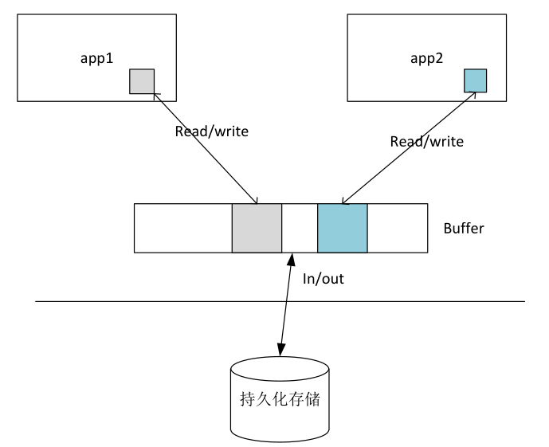
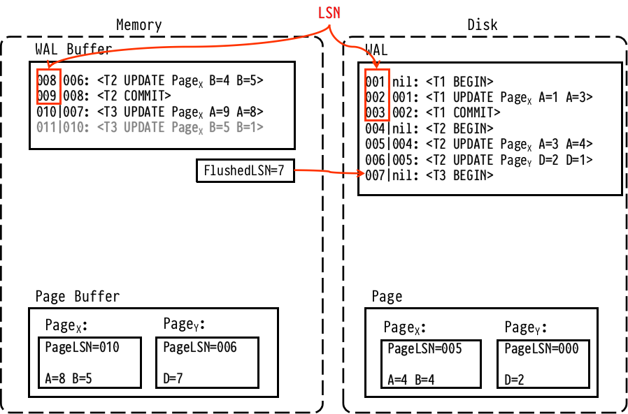
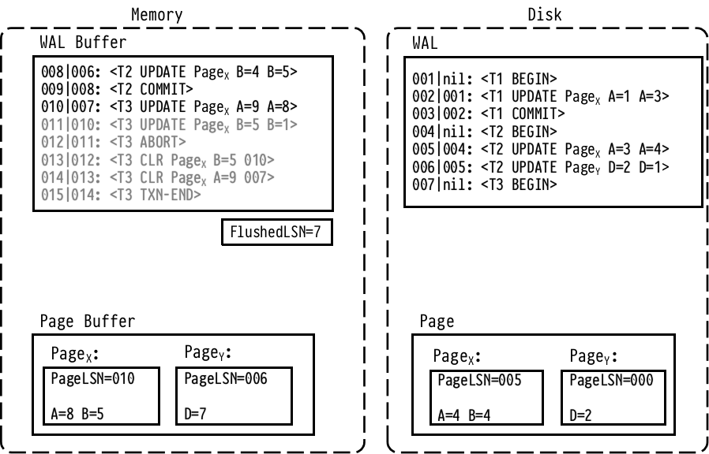
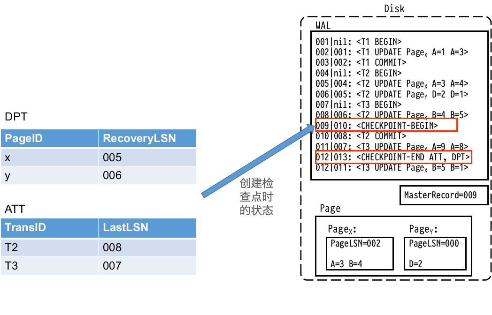
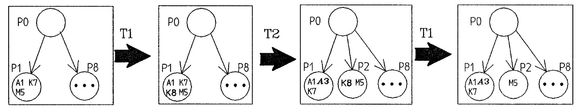
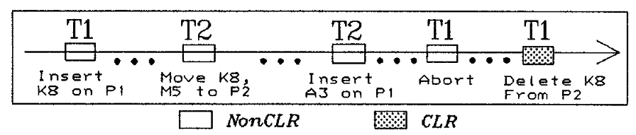

# 2020.09.25 分享纪要

- 分享人：杨子宁
- 关键词：数据库恢复、写前日志、模糊检查点
- Keywords: Database Recovery, WAL, Fuzzy Checkpoint 
- 分享PPT: [2020-09-25-ARIES](./slides/2020-09-25-ARIES.pdf)

## 分享内容： ARIES 事物恢复与日志设计

## 1. 背景

### 1.1 事务

在数据库系统中，事务是构成单一逻辑工作单元的操作集合。事务是动态执行过程的抽象，它是一种对公共资源并发访问与错误处理的范式。站在用户的立场上，事务表现为一段代码的执行。从应用程序员的观点上看，事务是包夹在BEGIN, COMMIT指令间的代码。站在整个系统的角度,事务是一个需要管理的、对公共资源访问的过程。

事务具有ACID特性，即原子性Atomicity、一致性Consistency、隔离性Isolation、持久性Durablity。

- 原子性要求一个事务实现要么全部完成要么不完成的语义,不允许事务执
  行一半。它的意思是:
  - 事务的原子性并不是说它的操作可以在一个CPU指令或者一次磁盘读写内完成,事务可以延续一段很长的时间。
  - 事务的原子性是指事务执行的最终结果有两个:完成或者失败。失败意味着事务什么也没做,不会对系统产生任何影响。
  - 当事务无法推进或者出现系统故障,事务执行了一半，按照原子性要求必须恢复到系统原先的状态。如果必要,需要记录事务的执行过程，以帮助恢复。
- 一致性要求事务的执行结果是一致的,这有两方面的要求:
  - 首先,逻辑上这个事务执行的期望结果必须是一致的，不会违反各种系统的逻辑约束。这个逻辑上的一致性一般是系统无法保证的，必须由用户自己确定。这也是为什么用户需要显式地用BEGIN、COMMIT指令定义事务的原因,包夹在BEGIN和COMMIT一段指令的潜台词是:用户保证这段代码的执行结果不会破坏系统的一致性。
  - 其次,在用户保证逻辑一致的前提下,系统承诺:在多事务并发执行或者出现系统错误情况下,这段代码仍然能够按照用户的预期执行或者失败。
  - 最后,虽然结果是一致的,但是事务的执行需要时间,需要一系列的动作,在这个过程中,系统并没有保证中间状态是一致的。
- 隔离性要求事务以隔离的方式并发地访问公共资源，彼此不产生干扰。隔离性要求系统小心地控制多个事务去访问公共资源。从一致性结果来看，事务一个一个地迭代执行,总能保证结果是正确的,但是这样性能太低。隔离性的实质是在一致性前提下如何发调度多个事务以取得更高的系统性能。
  - 要对公共资源的访问做隔离，手段无非是两个:一个是时间上隔离，要求事务按一定顺序去访问;另一个是空间上的隔离,对公共资源做多版本。直观上，空间上的隔离更具优势。
-  持久化要求一旦事务正确完成,即使出现系统故障,它的影响也会一直延续。这有两层含义:
  -  事务完成后,它对公共资源的修改被持久化的记录,后续事务对该资源的访问都受这个事务的影响。
  -  即使出现系统故障,也不会破坏该事务对资源的改动。

事务概念面临的最主要问题是在高度并发的数据访问中保证数据的一致性，而不论发生什么样的错误。事务的ACID四个要求最后归结为系统的两个方面的功能需求：

- 并发控制：并发的公共资源访问中保确保事务的隔离性。
- 故障恢复：在事务对公共资源的访问过程中,系统故障不会对公共资源产生影响。从而保证事务的原子性和持久性。

### 1.2 页模型

页模型（Page Model）是一个简单的模型，通过它可以很好地观察在数据库系统的存储层中，数据页是如何被访问（也就是读或写）的。页模型中，数据库包含一个有限数据页的集合，数据页不可分且不相交。所有对数据的高层操作最终都要转化成为对数据页的读写操作。事务被看成是具有全序关系的一组对页面操作的步骤。

数据库系统常驻于非易失性的存储器（通常是磁盘），并以页为存储单位。内存中有一个缓冲区用于临时存放磁盘上的页。每个事务T拥有自己的私有工作区，事务通过在其工作区和缓冲区传送数据来和数据库系统进行交互。

              

### 1.3缓冲策略和恢复

如果事务系统崩溃，内存缓冲区中的页面会丢失，活动的事务会失败。所以在重启的时候，需要把数据恢复到一致的状态并确保事务的**原子性**和**持久性**。具体需要进行的操作由缓冲区管理策略决定。

 **STEAL**和**NO-FORCE**的缓冲策略给了Buffer Manager 最大的灵活性:

- No-Force: 事务提交前，不强制将它所做的修改都写回磁盘。因此，系统崩溃时，已提交事务的修改可能还没有被写回磁盘
- Steal：事务提交前，就可以把它对页面的修改写回磁盘。因此，系统崩溃时，失败的事务可能已经把一些更新写入了磁盘

ARIES是一个经典的支持Steal、No-Force的事务恢复算法，1990s 由 IBM 开发。不是所有的系统都实现了论文中的 ARIES 算法，但是都是类似的。本次分享将对ARIES进行详细介绍。


## 2 ARIES 基本思想

### 2.1 预写日志  WAL

使用 Write-Ahead-Log（WAL）协议来支持**steal**和**no-force**策略。WAL要求：

1. 对任何更新操作，先记录日志。将更新写回**磁盘**之前，必须先把日志写到稳定的存储器上。
2. 一个事务的所有日志（包括commit日志）写入磁盘后才可以被提交。

灵活的缓冲管理：BM决定何时将脏页面写回磁盘，是一个在后台持续进行的过程，只需满足WAL条件。

### 2.2 Redo阶段重放历史

如果系统崩溃后，重启的时候，ARIES重放历史(Repeat History)，将系统带到崩溃时刻的状态，然后undo那些崩溃时仍然活动的事务（它们失败了）

### 2.3 记录Undo时所做的修改

撤销事务所做的操作也会被记录在日志。用来保证重复崩溃下的undo操作不会被重复执行

### 2.4 模糊检查点

使用检查点来减少恢复时需要执行的操作。在创建模糊检查点的过程中允许未完成的事务继续执行，不强制将脏页面刷回磁盘，只是记录一些必要的信息在检查点中。

## 3. ARIES 执行流程

### 3.1  LSN 与 WAL

#### 3.1.1日志顺序号 LSN

为每个日志分配一个全局唯一的编号log sequence number (LSN)。系统中不同的组件跟踪了与它们相关的LSN

- PageLSN

  位置：每个页面（磁盘上的物理页面和内存缓冲区中的页面）

  $PageLSN_{x}$ 是对页面$Page_{x}$最后的更新，类似于版本号。每当有更新操作发生在该页面上时，就将PageLSN更新为这条日志的LSN

- FlushedLSN

  位置：内存

  FlushedLSN 记录被写入磁盘的最后一条日志的LSN

#### 3.1.2 WAL缓冲和PageLSN

日志是顺序产生的。一条日志产生后，首先为其分配一个LSN，并将它追加到内存中的WAL缓冲队列。

日志线程将WAL缓冲队列中的日志批量地追加到磁盘上的WAL。内存中的FlushedLSN 记录被写入磁盘的最后一条日志的LSN。

数据以页面为单位存储在磁盘上，BM在内存中维护了一个页面缓冲区，对数据进行修改之前，必须将相关页面调入内存中的缓冲区。缓冲区中的每个页面都有一个PageLSN记录了它最后的更新。

日志记录了对页面的修改，这些修改被顺序地作用在缓冲区中的页面上。

BM按照一定的策略将缓冲区中被修改过的页面写回磁盘（包括页面的PageLSN信息）。



#### 3.1.3 WAL约束

WAL要求BM只能将满足以下条件的脏页面刷回磁盘：

 $PageLSN_{x} \le FlushedLSN$  （写回脏页面前，必须先把涉及到的日志写入磁盘）

上图中$FlushedLSN = 7$ 

- 页面X的$PageLSN_{x} = 10 $ ，对它修改的日志还没有写到磁盘。因此不可以刷回磁盘
- 页面Y的$PageLSN_{x} = 6 $，相关日志已经写到磁盘，因此可以被刷回磁盘

需要注意的是，即使日志没有写入磁盘，也可以对缓冲区中的页面进行修改，因为它是在内存中的，发生故障时会丢失。只有在日志被写回磁盘后，才会发送对该日志的确认信息。只要遵守WAL原则，磁盘上的数据就是可恢复的。

将写数据随机IO转换为了写日志顺序IO，并将修改批量延迟写回磁盘。一旦日志安全写到磁盘，事务就持久化了，即使断电了，可以重放日志并且恢复已经提交的事务，这样BM无须在每个事务提交时把缓冲池的脏块刷新到磁盘中。事务修改的数据和索引通常会映射到表空间的随机位置，所以刷新这些变更到磁盘需要很多随机IO。有了日志就可以批量的写回脏页面减小代价。

### 3.2 更新日志记录与事务提交流程

**更新日志记录**

事务对数据库进行任何修改之前，先写更新日志记录

LSN：[prevLSN, TransID, "update", pageID, redo Info, undo Info]

- LSN (Log Sequence Number)每条日志拥有一个全局唯一单调递增的LSN
- PrevLSN：当前事务的前一条日志的LSN。如果已经是第一条日志，那么PrevLSN为空
- TransID：产生这条日志的事务ID
- PageID：对应的更新操作作用的页面ID
- redo Info：记录如何redo这次更更新的操作
- undo Info：记录如何undo这次更新的操作

**事务提交流程**

1. 事务$T_{i}$执行过程中，对于每一个更新操作：
   1. 写下一条更新日志记录
   2. 更新缓冲区相应的数据
2. 事务$T_{i}$准备提交，写一条Commit日志
3. 当FlushedLSN >= Commit日志的LSN，事务提交成功
4. 为事务$T_{i}$写一条TXN-END日志

### 3.3 补偿日志记录和事务回滚流程

**补偿日志记录**（Compensation Log Record, CLR）

CLR记录了系统撤销失败事务时对数据库所做的操作。CLR日志只会被Redo不会被Undo。如果系统在恢复阶段崩溃了，那么再次启动重新恢复的时候，应该继续上一次未完成的Undo（redoTheUndo），而不是撤销未完成的Undo。

LSN：[prevLSN, TransID, "compensation", redoTheUndo Info, undoNextLSN]

- redoTheUndo Info：记录如何执行一次undo操作

- undoNextLSN：指向了下一条需要被撤销的日志

  ​	这条CLR撤销了更新日志记录LR，CLR.undoNextLSN=LR.prevLSN

**事务回滚流程**

1. 事务$T_{i}$执行了一些更新操作后被abort，写一条Abort日志
2. 倒序遍历事务$T_{i}$的日志，对它的每一个更新日志记录：
   1. 写一条补偿日志记录CLR
   2. 将缓冲区中相应的数据恢复成旧值，同时更新相应PageLSN
3. 为事务$T_{i}$写一条TXN-END日志



## 4 ARIES 模糊检查点

系统崩溃，重启时使用日志进行恢复。原则上分析阶段需要检查整个日志，通常使用检查点来加快恢复过程。

**普通检查点**：创建检查点时让数据库进入一致的状态

- 阻止任何新事务的启动
- 等待所有事务执行完成
- 将所有脏页面刷到磁盘

**模糊检查点**（fuzzy checkpoint）：创建检查点时不暂停事务

- 允许未完成的事务继续执行
- 不强制将脏页面刷回磁盘，脏页面由BM持续写回磁盘，不影响事务执行和检查点的创建
- 只记录相关信息到检查点中

### 4.1 相关数据结构

采用模糊检查点，由于它的上述特性，在检查点中需要记录两个数据结构：ATT和DPT

#### 4.1.1 活动事务表 Active Transaction Table(ATT)

由于允许创建模糊检查点时存在未提交事务，因此需要在检查点中（使用ATT表）记录下来当前活动的事物。以便在恢复时找到需要回滚的事务。

ATT每个表项记录了以下信息：

- TransID: 事务ID
- LastLSN: 这一事务所做的最后修改产生的日志的LSN。撤销时，可以用该信息快速找到需要撤销的更新日志

ATT由事务管理器管理，每当事务产生了一条更新日志记录，就更新它在活动事务表中的表项。如果事务提交，就将它从表项中删除

#### 4.1.2 脏页表 Dirty Page Table(DPT)

由于创建模糊检查点时不强制将脏页面刷回磁盘，需要在检查点中（使用DPT表）记录下脏页面：那些在缓冲区中被更新过，但还没有写回磁盘的页面。以便在恢复时确定需要重做哪些日志。

DPT中每个表项包含了以下信息：

- pageID: 页面 ID
- recoveryLSN: 使当前页面变脏（与磁盘上不一致）的第一条日志的LSN

DPT由缓冲管理器管理，一个页面首次被修改时会被加入脏页表项，Buffer Manager将其写回磁盘时将相应表项删除

#### 4.1.3 检查点日志

由于创建模糊检查点时允许事务继续执行，而准备检查点需要一些时间，因此使用两个日志来标识检查点的边界

- $<CheckpointBegin>$ 标识检查点的开始

- $<CheckpointEnd, ATT_{ckpt}, DPT_{ckpt}>$  包含ATT和DPT信息（检查点开始时的状态）

#### 4.1.4 MasterRecord

成功写完一个模糊检查点后，更新磁盘上的MasterRecord，让其指向最后一个成功的检查点。系统恢复时从这条日志开始。

下图是一个模糊检查点的例子



### 4.2 模糊检查点创建流程

- 写$<CheckpointBegin>$日志
- 为TT和DPT表创建一份副本（写 $<CheckpointBegin>$日志时的版本），可以使用COW实现，以减小代价
  - $ATT_{ckpt}$ 和 $DPT_{ckpt}$ 
  - $ATT_{now}$ 和 $DPT_{now}$
- 事务可以继续运行，执行操作时修改 $ATT_{now}$ 和 $DPT_{now}$
- 准备好信息后，写$<CheckpointEnd, ATT_{ckpt}, DPT_{ckpt}>$ 日志
- $<CheckpointEnd, ATT_{ckpt}, DPT_{ckpt}>$ 写入磁盘后，更新磁盘上的$MasterRecord=<CheckpointBegin>$日志的LSN

## 5 ARIES 恢复流程

系统崩溃后，重启时进行恢复操作，分为三个步骤

```
Time                                                              
--------------->

    	需要撤销事务      最早可能出  最后一个成功                                
        最早可能的修改    现的脏页面   的检查点              CRASH
             |             |       |                       |
LOGS(WAL)    |             |       |                       |
=============|=============|=======|=======================|
             |             |       |                       |
             |             |       |1. Analysis            |
             |             |       |---------------------->|
             |             |                               |
             |             |2. Redo                        |
             |             |------------------------------>|
             |                                             |
             |3. Undo                                      |
             |<--------------------------------------------|
```

1. Analysis Phase：从检查点开始扫描日志
   - 找出崩溃发生时的DPT（由此并计算出Redo阶段从哪个日志RedoLSN开始）
   - 找出崩溃发生时的ATT（Undo阶段撤销它们）

2. Redo Phase：从RedoLSN开始，从前往后重放历史（repeat history），redo每一条日志，包括那些失败事务的日志记录，将恢复到崩溃前的状态（保证Durability）

3. Undo Phase：从后往前撤失败事务的影响 (保证 Atomicity)

### 5.1 Analysis Phase

从上一个成功的检查点开始分析日志，构造崩溃时的TT和DPT表

1. 读取磁盘上的MasterRecord，找到最后一个成功的$<CheckpointBegin>$的LSN

2. 从$<CheckpointBegin>$开始正向扫描，将得到的日志缓存起来

3. 直到发现 $<CheckpointEnd, ATT, DPT>$日志，用它初始化ATT和DPT表

4. 从头扫描之前缓存的日志和$<CheckpointEnd, ATT, DPT>$之后剩余的日志

- 发现属于不在ATT表中事务的日志，就将其加入TT，并更新LastLSN为日志的LSN
- 发现一个结束的事务（已提交或者回滚完成），将其从ATT表中删除
- 发现一个更新了页面的日志记录，如果这个页面不在DPT中，就将其添加进在DPT并设置recoveryLSN为该日志的LSN

5. RedoLSN=DPT表中最小的recoveryLSN

### 5.2 Redo Phase

从RedoLSN开始正向扫描日志，只要找到一个更新日志记录或者补偿日志记录，就执行以下操作：

1. 如果该页不在DPT，跳过
2. 如果该日志的LSN小于脏页表中的recoveryLSN，跳过
3. 否则，从磁盘调出该页到缓冲区，如果页面的PageLSN小于日志记录的LSN，就重做该日志记录（这里保证了redo是幂等的，支持物理逻辑redo）

需要注意的是分析阶段得到的DPT表中的页面不一定是脏的。因为这个DPT是在分析阶段通过checkpoint中的DPT和之后的日志得到的。而在checkpoint之后Buffer Mamager可能把部分脏页面写回磁盘了。 

为页面记录PageLSN，允许我们将其和日志进行比较，以确保日志只会对页面做一次修改，提高了效率的同时，可以支持物理逻辑操作。

### 5.3 Undo Phase

撤销阶段反向扫描日志，并对ATT表中的事务进行撤销。

首先通过ATT表得到每个需要撤销事务的下一个需要撤销的日志 nextLSN，

- 如过ATT表中该事务的LastLSN是一条更新日志记录，那么nextLSN=LastLSN
- 如果ATT表中该事务的LastLSN是一条补偿日志记录CLR，那么nextLSN=CLR.UndoNextLSN

找到最大的nextLSN，执行以下操作，直到撤销完所有ATT中的事务：

1. 产生一个撤销该操作的CLR（物理逻辑日志），并设置CLR的UndoNextLSN设置为该日志的PrevLSN
2. 在相应页面上执行redoTheUndo操作
3. 将该事务的nextLSN指向被撤销日志的PrevLSN


## 6 日志类型

### 6.1 物理日志

物理日志记录了对页面的具体修改，包括了

- 页面位置，数据在页面内的偏移量和长度
- 前象和后象

对物理日志的redo或undo是幂等的，只涉及到单个页面，且多次重做或撤销得到相同的结果，很容易地支持从重复崩溃中恢复。

### 6.2 逻辑日志

逻辑日志只在逻辑层面去记录修改，而不是对页面具体的修改。例如向一个B树插入一个索引项，可能需要设计到多个页面的分裂，然后在将所印项插入某个页面。物理日志依次记录下对每个页面的具体修改。而逻辑日志只会记录下一个删除操作和对应的数据项。

逻辑日志减小了需要的日志体积，隐藏了复杂的操作。但是在恢复阶段，要对逻辑日志进行redo或undo时，需要读取或修改多个页面。崩溃时，难以确定逻辑日志的哪部分被反映在数据库了。需要复杂的逻辑来确保恢复的正确性。

### 6.3 物理逻辑日志

物理逻辑日志physiological log将日志的范围限定在一个页面内，但是页面内的操作可以是逻辑的。例如，将某个值+1操作。物理逻辑日志避免了逻辑日志的不一致问题，同时提供了一定的灵活性。

## 6. Page-oriented Redo 和 Logical Undo 

在ARIES中，redo支持**物理日志**或**物理逻辑日志**(physiological)，undo还支持**逻辑日志**(logical)。前文假设redo和undo都使用物理逻辑日志。

### Page-oriented redo

Page-oriented 日志具体描述了一个页面是怎么更改的,  而不需要去查数据库的内部metadata。注意，这意味着不同页面的Page-oriented日志是完全相互无关的, 可以并行进行。

Redo log是为了“记住已经在page上进行过了的操作”，这些操作是已经发生了的(只是还没写回硬盘), 它们之所以可以进行，是因为很多检查已经做完了（可能获得了相关的锁），因此Redo log被设计为page-oriented。

### Logical undo

逻辑日志只在逻辑层面去记录修改（例如删除一个B树中的某个节点）。可以支持索引结构上的更高并行度。这是因为Logica undo允许一个事务T1未提交的更改（写入一个B+树索引项K8到页面P1）, 被另外一个事务T2的操作影响(也插入了一个索引项A3，导致节点P1分裂，索引项K8被移动到另一个页面去了P2)。这个时候如果T1回滚，它之前插入的索引项K8已经不在页面P1上了。

如果只支持page-oriented undo, 那么就已指定了undo具体发正在哪个页面，那么T2必须等待T1 commit之后(绝对不会发生Undo A的情况),  才能进行分分裂节点操作，移动A的数据的操作。





Undo Log是为了“记住未来如果要回滚我们应该做什么”，如果把Undo设计为底层页面级应该做什么操作，我们就把现在的环境和未来绑定在一起了，而未来是充满非确定性的(比如index分页), 而如果高层的Logical Undo写的不是我们应该对哪个页面做什么，而只是把语意层面必须要做的Undo信息留下了，就允许了底层的各种细节可以发生变化，只要语意层面在未来把“更改”回滚即可，从而使得系统的其他逻辑可以对这些细节进行更改(比如移动未committed的数据到其他页面)而不必被Recovery的逻辑所束缚。

ARIES的论文中只是提到了它可以支持逻辑undo日志，但是并没有指出具体实现。下面是一种实现方案：

事务执行时创建逻辑undo日志的步骤：

1. 事务在执行修改操作（例如在某个B+树中添加一个索引项）之前，先创建一个 $<T_{i}, O_{j}, OerationBegin>$ 日志，$O_{j}$是该操作的唯一标识。

2. 执行这个操作，为它对应的所有更新写更新日志记录（该操作可能涉及多个页面的修改，分贝为每个修改创建一条物理日志或物理逻辑日志）

3. 操作结束时，写下$<T_{i}, O_{j}, OerationEND, U>$ 日志，其中 U是逻辑undo信息（例如删除B+树中的某个索引项）

逻辑undo的回滚

1. Undo阶段反向扫描的过程中，如果发现一条$<T_{i}, O_{j}, OerationEND, U>$日志
   1. 使用undo信息U来回滚该操作，将执行的操作记录成更新日志记录（而不是补偿日志记录，因为如果undo的中途失败，必须对这次undo进行撤销）
   2. 回滚完成后，写下一条$<T_{i}, O_{j}, OerationAbort>$日志
   3. 跳过$T_{i}$的所有日志，直到碰到$<T_{i}, O_{j}, OerationBegin>$ 日志
2. 如果发现一条$<T_{i}, O_{j}, OerationAbort>$日志，跳过$T_{i}$的所有日志，直到碰到$<T_{i}, O_{j}, OerationBegin>$ 日志

## Reference

- https://cs.stanford.edu/people/chrismre/cs345/rl/aries.pdf
- https://courses.cs.washington.edu/courses/cse544/11wi/papers/franklin97.pdf
- https://www.youtube.com/watch?v=zx2DbpbqiHg
- https://www.youtube.com/watch?v=S9nctHdkggk
- https://stackoverflow.com/a/37861999
- https://www.ics.uci.edu/~cs223/papers/p371-mohan.pdf