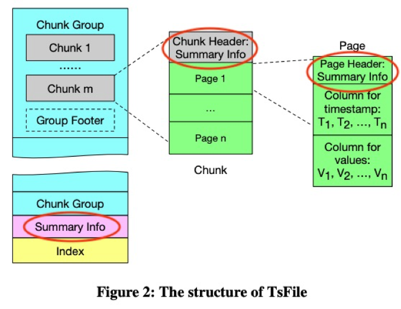

### Apache IoTDB时序数据库概述

------

- 时间：2021.11.12
- 分享人：周帆
- 关键字：IoTDB、Aggregate Query、PISA、Dual-PISA
- 分享PPT:[2021-11-12-Apache-IoTDB时序数据库](./slides/2021-11-12-Apache-IoTDB时序数据库.pdf)

### 分享内容

------

#### 问题描述

针对传统时序数据库聚合性能差问题，本次分享对Apache IoTDB时序数据库的文件格式、聚合查询索引(PISA)、基于乱序数据的聚合查询索引(Dual-PISA)进行了详细分析。

#### 分享内容

**一、文件格式**

TsFile：时间序列文件格式

三层结构：Chunk Group（设备） -> Chunk（测点） -> Page（times-values）

参考文献：[Apache IoTDB: Time-series Database for Internet of Things ](https://www.vldb.org/pvldb/vol13/p2901-wang.pdf)

**二、聚合索引(PISA)**

- 待解决的问题
  - 层级读取，将读取很多不必要的节点
  - 如何只读与结果集合有关的节点，避免不必要的查询
- 核心思想
  - 重新建立索引结构，运用公式跳级查询
- 解决方法
  1. 节点定义。对于树中节点，不存储节点所覆盖的时间范围，而是定义**代码号**(code number)和**序列号**(serial number)
  2. 索引构建。基于Segment Tree，采用森林结构，并采用在适当的时间将两棵树结合起来的**插入算法**
  3. 查询算法。放弃层级读取，使用**公式**直接定位有关节点，避免读取不必要的节点

参考文献：[PISA: an Index for Aggregating Big Time Series Data](https://dl.acm.org/doi/pdf/10.1145/2983323.2983775)

**三、基于乱序数据的聚合索引(Dual-PISA)**

- 待解决问题
  - PISA只能处理有限的乱序数据，大部分乱序数据直接被丢弃
  - 当面对大部分乱序数据时，应当如何处理以保证数据的正确性
- 核心思想
  - 优化PISA，建立Dual-PISA，有序数据与乱序数据分开管理

- 解决方法
  1. 设置容忍数据区间E，管理90%的乱序数据，抛弃10%的乱序数据
  2. 乱序数据索引结构与顺序数据索引结构相同
  3. 顺序数据，乱序数据分开管理并查询

参考文献：[Dual-PISA: An index for aggregation operations on time series data](https://www.sciencedirect.com/science/article/pii/S0306437918305489)
