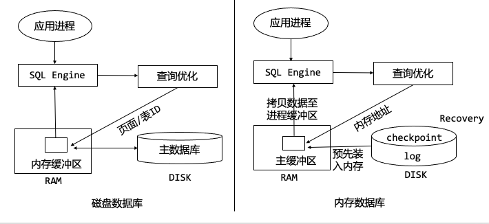
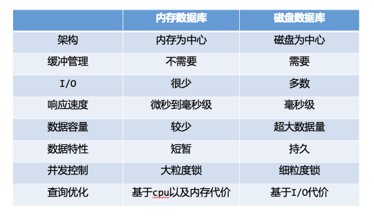

# 内存数据库简述及索引优化

- 时间：2022.03.25
- 分享人：周帆
- 关键字：内存数据库、索引结构、Trie、ART、HOT、Hyperion
- 分享PPT: [2022-03-25-内存数据库简述及索引优化](./slides/2022-03-25-内存数据库简述及索引优化.pdf)

## 分享内容

### 内容概述

基于内存数据库与磁盘数据库架构，简述内存数据库的特性、关键技术等，并提出内存数据库索引优化方向，最后对索引优化技术做出详细分析。

### 分享内容

**一、内存数据库概述**

定义：数据全部或大部分放入内存，磁盘作为数据的后备存储设备

DRDB 🆚 MMDB(架构)：

总结：

**二、Adaptive Radix Trie（ART）**

- 待解决的问题
  - 单个字符单独存储导致树的高度较大，时间延迟过高
  - 大量预分配导致空间浪费
- 核心思想
  - 讲数据进行二进制展开，多个字符存入一个节点，增大span并固定，动态选择节点类型
- 解决方法
  1. 合并节点，压缩路径。当节点只有一个孩子节点时，讲节点进行合并。
  2. 增大span。字符的宽度称为span，增大span相当于增大前缀压缩的长度。
  3. Adaptive Nodes。自定义四种节点类型，可针对实际情况选择适当的节点类型。

参考文献：[The Adaptive Radix Tree: ARTful Indexing for Main-Memory Databases](https://db.in.tum.de/~leis/papers/ART.pdf)

**三、Height Optimized Trie（HOT）**

- 待解决问题
  - 对于sparsely key，用Node256存储，也会导致大量节点空间浪费
- 核心思想
  - 自适应节点，动态span，固定fanout
- 解决方法
  1. 只存储特征点信息。将数据用二进制表示，compound node中的inner node不存储完整数据，只存储特性点信息，leaf node存储数据完整信息，大大降低内存空间占用。
  2. 固定fanout。fanout指compound node中leaf node个数，也就是一个节点中的字符数，当插入节点后，需动态调整树高，以固定fanout，并保持树高稳定。
  3. 编码存储适应SIMD。为了SIMD操作，将Partial key与SIMD对齐，最终实现并行处理。

参考文献：[HOT: A Height Optimized Trie Index for Main-Memory Database Systems](https://dbis.uibk.ac.at/sites/default/files/2018-04/hot-height-optimized-author-version.pdf)

**四、Hyperion**

- 目标
  - 放弃写性能，以此达到更优的内存占用
- 核心思想
  - 顺序存储，紧凑的节点设计，适量分配空间，原地更新
- 总体方案
  1. 设置容器。以容器为单位进行顺序存储，并允许嵌套容器，容器以32B增长，防止过度分配
  2. Delta Encoding。分别对T-Node，S-Node进行增量编码，编码成功，即无需存储具体值，面向dense key场景，能大大降低内存消耗。
  3. 查询优化(引入跳表)。将T-Node/S-Node按数组个数进行等分，以此定位到最接近目标的节点。

参考文献：[Hyperion: Building the Largest In-memory Search Tree](https://core.ac.uk/download/pdf/288352806.pdf)

